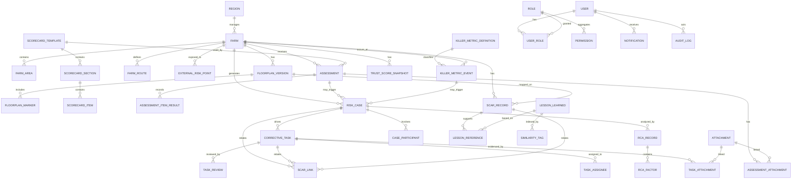

# Thiết kế dữ liệu mức logic (ERD)
## BIOSECURITY OS 2026

**Phiên bản:** 1.1  
**Ghi chú cập nhật:** Đã bổ sung diễn giải tiếng Việt rõ nghĩa cho từng bảng và từng cột quan trọng.  
**Ngày:** 2026-03-14  
**Phạm vi:** Thiết kế ERD mức logic cho MVP và khả năng mở rộng Phase 2  
**Nguồn gốc:** Dựa trên `biosecurity_os_2026_requirements_v2.md`

---

## 1. Mục tiêu ERD

ERD này phục vụ 4 mục tiêu:

1. Chuẩn hóa mô hình dữ liệu cho các module đánh giá ATSH, case, task, bằng chứng và scar memory.
2. Tách bạch rõ 3 lớp dữ liệu theo yêu cầu nghiệp vụ:
   - **Compliance score**
   - **Structural risk**
   - **Live epidemiological signal / incident**
3. Đảm bảo mọi đối tượng nghiệp vụ đều có thể truy vết end-to-end.
4. Hỗ trợ mở rộng trong tương lai cho recommendation engine, GIS, IoT và phân tích dịch tễ nâng cao.

---

## 2. Nguyên tắc mô hình hóa

- Không dùng một bảng điểm tổng duy nhất để thay cho toàn bộ logic nghiệp vụ.
- Mọi thực thể quan trọng phải có `id`, `status`, `created_at`, `created_by`, `updated_at`, `updated_by`.
- Các đối tượng cần chứng cứ hoặc thẩm định phải có liên kết tới `attachment`, `review` và `audit_log`.
- Các bản ghi tri thức di sản phải có **độ tin cậy** và **phiên bản mặt bằng** đi kèm.
- Ưu tiên **soft delete** hoặc `archived_at` cho dữ liệu điều tra và tri thức.

---

### 2.1 Cách đọc các bảng trong tài liệu này

- **Cột**: tên trường kỹ thuật sẽ dùng trong database/API.
- **Kiểu gợi ý**: kiểu dữ liệu khuyến nghị ở mức logic; khi triển khai có thể tinh chỉnh.
- **Bắt buộc**: `Có` nghĩa là trường nên có giá trị khi tạo bản ghi; `Không` nghĩa là được phép để trống.
- **Ghi chú**: giải thích bằng tiếng Việt về ý nghĩa nghiệp vụ của trường, không chỉ mô tả kỹ thuật.

### 2.2 Quy ước đọc tên trường thường gặp

| Tên trường | Ý nghĩa nghiệp vụ |
|---|---|
| `id` | Mã định danh nội bộ duy nhất của bản ghi. |
| `code` | Mã ngắn để hiển thị, báo cáo hoặc tích hợp. |
| `name` / `title` | Tên hoặc tiêu đề để người dùng nhận biết nhanh. |
| `status` | Trạng thái nghiệp vụ hiện tại của bản ghi. |
| `created_at` / `updated_at` | Mốc thời gian tạo và cập nhật cuối. |
| `..._user_id` | ID người dùng liên quan tới thao tác, trách nhiệm hoặc phê duyệt. |
| `..._id` | Khóa ngoại tham chiếu tới bảng khác. |

## 3. Danh sách thực thể chính

### 3.1 Nhóm tổ chức và người dùng
- `user`
- `role`
- `permission`
- `user_role`
- `region`

### 3.2 Nhóm trại và cấu trúc không gian
- `farm`
- `farm_area`
- `farm_route`
- `floorplan_version`
- `floorplan_marker`
- `external_risk_point`

### 3.3 Nhóm scorecard và đánh giá
- `scorecard_template`
- `scorecard_section`
- `scorecard_item`
- `assessment`
- `assessment_item_result`
- `assessment_attachment`
- `killer_metric_definition`
- `killer_metric_event`
- `trust_score_snapshot`

### 3.4 Nhóm case, RCA và task
- `risk_case`
- `case_participant`
- `rca_record`
- `rca_factor`
- `corrective_task`
- `task_assignee`
- `task_attachment`
- `task_review`
- `task_comment`

### 3.5 Nhóm scar memory và lesson learned
- `scar_record`
- `scar_link`
- `lesson_learned`
- `lesson_reference`
- `similarity_tag`

### 3.6 Nhóm hạ tầng dùng chung
- `attachment`
- `notification`
- `audit_log`
- `lookup_code`

---

## 4. ERD mức khái niệm

---

## 5. Thiết kế chi tiết từng bảng

## 5.1 Nhóm tổ chức và phân quyền

### `region`
Bảng danh mục vùng/cụm để gom trại theo địa bàn và phục vụ phân quyền.
| Cột | Kiểu gợi ý | Bắt buộc | Ghi chú |
|---|---|---:|---|
| id | uuid | Có | Khóa chính (PK) của bảng. |
| code | varchar(50) | Có | Mã vùng/cụm trại để chuẩn hóa báo cáo và phân quyền. |
| name | varchar(255) | Có | Tên vùng hoặc cụm trại, ví dụ Miền Tây 1. |
| manager_user_id | uuid | Không | Người quản lý phụ trách vùng/cụm này. |
| status | varchar(30) | Có | Trạng thái sử dụng của vùng: active/inactive. |
| created_at | timestamptz | Có | Thời điểm hệ thống tạo bản ghi. |
| updated_at | timestamptz | Có | Thời điểm cập nhật gần nhất. |

### `user`
Bảng tài khoản người dùng sử dụng hệ thống.
| Cột | Kiểu gợi ý | Bắt buộc | Ghi chú |
|---|---|---:|---|
| id | uuid | Có | Khóa chính (PK) của bảng. |
| username | varchar(100) | Có | Tên đăng nhập duy nhất vào hệ thống. |
| full_name | varchar(255) | Có | Họ tên đầy đủ của người dùng. |
| email | varchar(255) | Không | Email công việc; có thể để trống với lao động hiện trường không dùng email. |
| phone | varchar(30) | Không | Số điện thoại liên hệ. |
| region_id | uuid | Không | Vùng phụ trách chính nếu người dùng làm ở cấp vùng. |
| farm_id | uuid | Không | Trại gắn trực tiếp với người dùng nếu là nhân sự trại. |
| title | varchar(150) | Không | Chức danh hiển thị, ví dụ Quản lý trại hoặc Chuyên gia ATSH. |
| status | varchar(30) | Có | Trạng thái tài khoản: đang hoạt động, tạm khóa hoặc lưu trữ. |
| last_login_at | timestamptz | Không | Lần đăng nhập gần nhất, phục vụ kiểm soát sử dụng tài khoản. |
| created_at | timestamptz | Có | Thời điểm hệ thống tạo bản ghi. |
| updated_at | timestamptz | Có | Thời điểm cập nhật gần nhất. |

### `role`
Bảng vai trò nghiệp vụ/ứng dụng.
| Cột | Kiểu gợi ý | Bắt buộc | Ghi chú |
|---|---|---:|---|
| id | uuid | Có | Khóa chính (PK) của bảng. |
| code | varchar(50) | Có | Mã role kỹ thuật/nghiệp vụ, ví dụ EXEC, EXPERT, QA. |
| name | varchar(255) | Có | Tên role hiển thị bằng ngôn ngữ người dùng. |
| scope_type | varchar(30) | Có | Phạm vi role được áp dụng: toàn hệ thống, theo vùng hoặc theo trại. |
| description | text | Không | Giải thích vai trò này dùng cho nhóm người dùng nào. |

### `permission`
Bảng quyền thao tác chi tiết theo module.
| Cột | Kiểu gợi ý | Bắt buộc | Ghi chú |
|---|---|---:|---|
| id | uuid | Có | Khóa chính (PK) của bảng. |
| code | varchar(100) | Có | Mã quyền duy nhất để backend kiểm soát truy cập. |
| name | varchar(255) | Có | Tên quyền hiển thị cho admin hoặc tài liệu phân quyền. |
| module | varchar(100) | Có | Module mà quyền này áp dụng, ví dụ cases, tasks, scorecards. |
| action | varchar(50) | Có | Hành động được phép thực hiện, ví dụ read/create/update/review/approve. |

### `user_role`
Bảng nối user với role và phạm vi hiệu lực.
| Cột | Kiểu gợi ý | Bắt buộc | Ghi chú |
|---|---|---:|---|
| id | uuid | Có | Khóa chính (PK) của bảng. |
| user_id | uuid | Có | Người dùng được gán role. |
| role_id | uuid | Có | Role được gán cho người dùng. |
| scope_region_id | uuid | Không | Nếu role chỉ hiệu lực trong một vùng thì lưu vùng tại đây. |
| scope_farm_id | uuid | Không | Nếu role chỉ hiệu lực trong một trại thì lưu trại tại đây. |
| effective_from | date | Không | Ngày role bắt đầu có hiệu lực. |
| effective_to | date | Không | Ngày role hết hiệu lực; để trống nếu còn hiệu lực. |

---

## 5.2 Nhóm trại và digital twin

### `farm`
Bảng hồ sơ gốc của từng trại.
| Cột | Kiểu gợi ý | Bắt buộc | Ghi chú |
|---|---|---:|---|
| id | uuid | Có | Khóa chính (PK) của bảng. |
| code | varchar(50) | Có | Mã trại duy nhất, dùng xuyên suốt báo cáo, API và tích hợp. |
| name | varchar(255) | Có | Tên trại hiển thị cho người dùng. |
| farm_type | varchar(30) | Có | Loại trại, ví dụ nái (sow), thịt/finisher hoặc hỗn hợp. |
| ownership_type | varchar(30) | Có | Hình thức sở hữu/vận hành: trại công ty hay trại thuê. |
| region_id | uuid | Có | Vùng/cụm mà trại đang thuộc về. |
| address | text | Không | Địa chỉ mô tả của trại. |
| latitude | numeric(10,7) | Không | Vĩ độ vị trí trung tâm trại hoặc cổng chính. |
| longitude | numeric(10,7) | Không | Kinh độ vị trí trung tâm trại hoặc cổng chính. |
| capacity_headcount | integer | Không | Quy mô sức chứa tham chiếu của trại (đầu heo). |
| operational_status | varchar(30) | Có | Trạng thái vận hành của trại: active/paused/closed. |
| baseline_risk_level | varchar(30) | Có | Mức rủi ro nền mang tính cấu trúc của trại. |
| structural_risk_note | text | Không | Mô tả các điểm yếu nền như sai luồng, gần bãi rác, gần khu hủy heo. |
| opened_at | date | Không | Ngày trại bắt đầu vận hành. |
| closed_at | date | Không | Ngày trại ngừng vận hành nếu có. |
| created_at | timestamptz | Có | Thời điểm hệ thống tạo bản ghi. |
| updated_at | timestamptz | Có | Thời điểm cập nhật gần nhất. |

### `farm_area`
Bảng cấu trúc khu vực bên trong trại.
| Cột | Kiểu gợi ý | Bắt buộc | Ghi chú |
|---|---|---:|---|
| id | uuid | Có | Khóa chính (PK) của bảng. |
| farm_id | uuid | Có | Trại mà khu vực này thuộc về. |
| parent_area_id | uuid | Không | Khu cha để tạo cấu trúc phân cấp, ví dụ Barn 1 thuộc Khu chăn nuôi. |
| code | varchar(50) | Có | Mã khu vực duy nhất trong phạm vi một trại. |
| name | varchar(255) | Có | Tên khu vực hiển thị, ví dụ Cổng, Nhà tắm, Khu nái đẻ. |
| area_type | varchar(50) | Có | Loại khu vực để chuẩn hóa logic, ví dụ gate, shower, office, barn, quarantine. |
| clean_dirty_class | varchar(30) | Không | Phân loại sạch/buffer/bẩn phục vụ kiểm soát luồng ATSH. |
| is_active | boolean | Có | Đánh dấu khu này còn được sử dụng hay đã ngưng. |
| created_at | timestamptz | Có | Thời điểm hệ thống tạo bản ghi. |
| updated_at | timestamptz | Có | Thời điểm cập nhật gần nhất. |

### `farm_route`
Bảng mô tả các luồng di chuyển cần kiểm soát ATSH.
| Cột | Kiểu gợi ý | Bắt buộc | Ghi chú |
|---|---|---:|---|
| id | uuid | Có | Khóa chính (PK) của bảng. |
| farm_id | uuid | Có | Trại sở hữu tuyến/luồng này. |
| route_type | varchar(30) | Có | Loại luồng cần quản lý: người, xe, xác chết, cám... |
| from_area_id | uuid | Có | Điểm bắt đầu của luồng di chuyển. |
| to_area_id | uuid | Có | Điểm kết thúc của luồng di chuyển. |
| direction_rule | varchar(30) | Có | Quy tắc đi một chiều, hạn chế hoặc có điều kiện. |
| note | text | Không | Ghi chú nghiệp vụ về cách vận hành luồng. |

### `floorplan_version`
Bảng quản lý phiên bản sơ đồ mặt bằng trại.
| Cột | Kiểu gợi ý | Bắt buộc | Ghi chú |
|---|---|---:|---|
| id | uuid | Có | Khóa chính (PK) của bảng. |
| farm_id | uuid | Có | Trại áp dụng phiên bản sơ đồ này. |
| version_no | integer | Có | Số phiên bản tăng dần để lưu lịch sử thay đổi mặt bằng. |
| title | varchar(255) | Có | Tên phiên bản sơ đồ, thường gắn với đợt cải tạo hoặc giai đoạn vận hành. |
| effective_from | date | Có | Ngày sơ đồ bắt đầu được xem là bản vận hành chính thức. |
| effective_to | date | Không | Ngày sơ đồ hết hiệu lực nếu đã thay bằng bản mới. |
| plan_file_attachment_id | uuid | Không | File sơ đồ gốc đính kèm trong kho file. |
| status | varchar(30) | Có | Trạng thái phiên bản sơ đồ: draft/active/archived. |
| approved_by | uuid | Không | Người phê duyệt cho phép dùng phiên bản sơ đồ này. |
| approved_at | timestamptz | Không | Thời điểm phê duyệt phiên bản sơ đồ. |

### `floorplan_marker`
Bảng marker hiển thị trên sơ đồ/digital twin.
| Cột | Kiểu gợi ý | Bắt buộc | Ghi chú |
|---|---|---:|---|
| id | uuid | Có | Khóa chính (PK) của bảng. |
| floorplan_version_id | uuid | Có | Phiên bản sơ đồ mà marker này nằm trên đó. |
| area_id | uuid | Không | Khu vực nội bộ liên quan nếu marker trỏ tới một area chuẩn hóa. |
| marker_type | varchar(50) | Có | Loại marker: cổng, điểm rủi ro, điểm scar, checkpoint... |
| label | varchar(255) | Có | Nhãn hiển thị ngay trên sơ đồ. |
| x_percent | numeric(5,2) | Có | Tọa độ X theo phần trăm chiều ngang sơ đồ để hiển thị ổn định theo kích thước màn hình. |
| y_percent | numeric(5,2) | Có | Tọa độ Y theo phần trăm chiều dọc sơ đồ. |
| metadata_json | jsonb | Không | Thông tin mở rộng cho marker, ví dụ màu, icon, loại liên kết. |

### `external_risk_point`
Bảng điểm nguy cơ bên ngoài ảnh hưởng tới trại.
| Cột | Kiểu gợi ý | Bắt buộc | Ghi chú |
|---|---|---:|---|
| id | uuid | Có | Khóa chính (PK) của bảng. |
| farm_id | uuid | Có | Trại bị ảnh hưởng bởi điểm rủi ro bên ngoài này. |
| risk_type | varchar(50) | Có | Loại rủi ro bên ngoài, ví dụ bãi rác, lò mổ, khu tiêu hủy, ao nước thải. |
| name | varchar(255) | Không | Tên hoặc mô tả ngắn của điểm rủi ro. |
| latitude | numeric(10,7) | Có | Vĩ độ của điểm rủi ro bên ngoài. |
| longitude | numeric(10,7) | Có | Kinh độ của điểm rủi ro bên ngoài. |
| distance_m | integer | Không | Khoảng cách ước tính từ trại tới điểm rủi ro, tính bằng mét. |
| note | text | Không | Ghi chú thêm về bối cảnh hoặc mức độ ảnh hưởng. |
| confidence_level | varchar(20) | Có | Độ tin cậy của thông tin điểm rủi ro: suspected/probable/confirmed. |

---

## 5.3 Nhóm scorecard và đánh giá

### `scorecard_template`
Bảng mẫu scorecard theo loại trại/rủi ro.
| Cột | Kiểu gợi ý | Bắt buộc | Ghi chú |
|---|---|---:|---|
| id | uuid | Có | Khóa chính (PK) của bảng. |
| code | varchar(50) | Có | Mã bộ scorecard để version hóa và tích hợp. |
| name | varchar(255) | Có | Tên bộ scorecard hiển thị, ví dụ Trại nái thuê rủi ro cao. |
| farm_type | varchar(30) | Không | Loại trại mà mẫu scorecard này áp dụng. |
| ownership_type | varchar(30) | Không | Áp dụng cho trại công ty hay trại thuê. |
| risk_profile | varchar(30) | Không | Hồ sơ rủi ro mục tiêu của mẫu, ví dụ high-risk lease. |
| version_no | integer | Có | Phiên bản của bộ scorecard. |
| status | varchar(30) | Có | Trạng thái mẫu: draft/active/archived. |
| effective_from | date | Có | Ngày mẫu bắt đầu được dùng. |
| effective_to | date | Không | Ngày mẫu ngưng hiệu lực nếu có mẫu mới thay thế. |

### `scorecard_section`
Bảng nhóm tiêu chí trong một scorecard.
| Cột | Kiểu gợi ý | Bắt buộc | Ghi chú |
|---|---|---:|---|
| id | uuid | Có | Khóa chính (PK) của bảng. |
| template_id | uuid | Có | Mẫu scorecard mà nhóm tiêu chí này thuộc về. |
| code | varchar(50) | Có | Mã nhóm tiêu chí duy nhất trong một mẫu. |
| name | varchar(255) | Có | Tên nhóm tiêu chí, ví dụ Hạ tầng hoặc Quy trình. |
| section_type | varchar(30) | Có | Loại nhóm để gom logic tính điểm, ví dụ hardware/software/behavior/monitoring. |
| weight | numeric(8,2) | Có | Trọng số của nhóm tiêu chí trong tổng điểm. |
| display_order | integer | Có | Thứ tự hiển thị trên UI và biểu đồ. |

### `scorecard_item`
Bảng tiêu chí/câu hỏi chi tiết dùng để chấm điểm.
| Cột | Kiểu gợi ý | Bắt buộc | Ghi chú |
|---|---|---:|---|
| id | uuid | Có | Khóa chính (PK) của bảng. |
| section_id | uuid | Có | Nhóm tiêu chí mà câu hỏi này thuộc về. |
| code | varchar(50) | Có | Mã câu hỏi/tiêu chí duy nhất trong nhóm. |
| question_text | text | Có | Nội dung tiêu chí hoặc câu hỏi đánh giá. |
| response_type | varchar(30) | Có | Kiểu câu trả lời đầu vào, ví dụ yes_no, score_0_5, option, numeric. |
| max_score | numeric(8,2) | Có | Điểm tối đa của tiêu chí. |
| weight | numeric(8,2) | Có | Trọng số của tiêu chí trong nhóm. |
| is_killer_related | boolean | Có | Đánh dấu tiêu chí này có liên quan tới killer metric hay không. |
| threshold_warning | numeric(8,2) | Không | Ngưỡng cảnh báo để UI tô màu hoặc kích hoạt theo dõi. |
| threshold_fail | numeric(8,2) | Không | Ngưỡng xem là không đạt nghiêm trọng. |
| guidance_text | text | Không | Hướng dẫn chấm điểm hoặc giải thích tiêu chí cho người đánh giá. |
| display_order | integer | Có | Thứ tự hiển thị trong form đánh giá. |

### `assessment`
Bảng phiếu đánh giá hoặc audit.
| Cột | Kiểu gợi ý | Bắt buộc | Ghi chú |
|---|---|---:|---|
| id | uuid | Có | Khóa chính (PK) của bảng. |
| farm_id | uuid | Có | Trại được đánh giá. |
| template_id | uuid | Có | Mẫu scorecard được sử dụng cho phiếu đánh giá này. |
| assessment_type | varchar(30) | Có | Loại đánh giá: tự đánh giá, audit định kỳ, spot, blind... |
| assessment_date | timestamptz | Có | Thời điểm thực hiện đánh giá. |
| performed_by_user_id | uuid | Có | Người trực tiếp thực hiện đánh giá. |
| performed_by_name_snapshot | varchar(255) | Có | Tên người đánh giá được chụp lại tại thời điểm đó để tránh thay đổi lịch sử khi user đổi tên. |
| overall_score | numeric(8,2) | Không | Tổng điểm của phiếu sau khi tính toán. |
| hardware_score | numeric(8,2) | Không | Điểm nhóm hạ tầng/phần cứng. |
| process_score | numeric(8,2) | Không | Điểm nhóm quy trình. |
| behavior_score | numeric(8,2) | Không | Điểm nhóm hành vi/kỷ luật. |
| monitoring_score | numeric(8,2) | Không | Điểm nhóm giám sát/phát hiện. |
| status | varchar(30) | Có | Trạng thái phiếu đánh giá: nháp, đã gửi, đã review, đã khóa. |
| summary_note | text | Không | Nhận xét tổng hợp của người đánh giá hoặc reviewer. |
| trust_gap_basis_id | uuid | Không | Tham chiếu tới phiếu audit đối chiếu để tính trust gap nếu có. |
| created_at | timestamptz | Có | Thời điểm hệ thống tạo bản ghi. |
| updated_at | timestamptz | Có | Thời điểm cập nhật gần nhất. |

### `assessment_item_result`
Bảng kết quả từng tiêu chí trong một phiếu đánh giá.
| Cột | Kiểu gợi ý | Bắt buộc | Ghi chú |
|---|---|---:|---|
| id | uuid | Có | Khóa chính (PK) của bảng. |
| assessment_id | uuid | Có | Phiếu đánh giá chứa kết quả dòng này. |
| scorecard_item_id | uuid | Có | Tiêu chí scorecard được chấm. |
| response_value_text | text | Không | Giá trị trả lời dạng chữ hoặc lựa chọn. |
| response_value_numeric | numeric(8,2) | Không | Giá trị trả lời dạng số nếu tiêu chí hỗ trợ. |
| awarded_score | numeric(8,2) | Có | Điểm thực nhận của tiêu chí. |
| is_non_compliant | boolean | Có | Đánh dấu tiêu chí không đạt tuân thủ. |
| note | text | Không | Ghi chú hiện trường cho riêng tiêu chí này. |
| area_id | uuid | Không | Khu vực trong trại mà kết quả này gắn với. |
| evidence_required | boolean | Có | Tiêu chí này có bắt buộc đính kèm bằng chứng hay không. |

### `assessment_attachment`
Bảng liên kết file bằng chứng cho assessment.
| Cột | Kiểu gợi ý | Bắt buộc | Ghi chú |
|---|---|---:|---|
| id | uuid | Có | Khóa chính (PK) của bảng. |
| assessment_id | uuid | Có | Phiếu đánh giá mà file này đính kèm. |
| attachment_id | uuid | Có | File bằng chứng cụ thể trong kho file. |
| area_id | uuid | Không | Khu vực liên quan tới file nếu có. |
| caption | text | Không | Chú thích giúp hiểu nhanh nội dung file. |

### `killer_metric_definition`
Bảng định nghĩa các killer metric của doanh nghiệp.
| Cột | Kiểu gợi ý | Bắt buộc | Ghi chú |
|---|---|---:|---|
| id | uuid | Có | Khóa chính (PK) của bảng. |
| code | varchar(50) | Có | Mã killer metric, ví dụ SWILL_FEED hoặc RED_LINE_BREACH. |
| name | varchar(255) | Có | Tên ngắn của killer metric. |
| description | text | Có | Giải thích điều kiện nào được xem là vi phạm killer metric. |
| severity_level | varchar(20) | Có | Mức độ nghiêm trọng chuẩn của killer metric. |
| default_case_priority | varchar(20) | Có | Mức ưu tiên case mặc định khi metric này xảy ra. |
| active_flag | boolean | Có | Có còn dùng metric này trong vận hành hiện tại hay không. |

### `killer_metric_event`
Bảng sự kiện killer metric thực tế phát sinh.
| Cột | Kiểu gợi ý | Bắt buộc | Ghi chú |
|---|---|---:|---|
| id | uuid | Có | Khóa chính (PK) của bảng. |
| farm_id | uuid | Có | Trại xảy ra sự kiện killer metric. |
| area_id | uuid | Không | Khu vực cụ thể nơi phát hiện sự kiện nếu xác định được. |
| definition_id | uuid | Có | Loại killer metric đã bị kích hoạt. |
| event_at | timestamptz | Có | Thời điểm phát hiện hoặc ghi nhận sự kiện. |
| detected_by_user_id | uuid | Có | Người phát hiện hoặc người ghi nhận sự kiện. |
| source_type | varchar(30) | Có | Nguồn phát hiện: assessment, audit, field report... |
| summary | text | Có | Mô tả ngắn nội dung vi phạm hoặc sự kiện. |
| status | varchar(30) | Có | Trạng thái xử lý sự kiện killer metric. |
| required_case_flag | boolean | Có | Đánh dấu bắt buộc phải mở case review cho sự kiện này. |

### `trust_score_snapshot`
Bảng snapshot điểm tin cậy giữa tự đánh giá và audit độc lập.
| Cột | Kiểu gợi ý | Bắt buộc | Ghi chú |
|---|---|---:|---|
| id | uuid | Có | Khóa chính (PK) của bảng. |
| farm_id | uuid | Có | Trại được tính trust score. |
| source_self_assessment_id | uuid | Có | Phiếu tự đánh giá dùng làm vế tự khai. |
| source_audit_assessment_id | uuid | Có | Phiếu audit độc lập dùng để đối chiếu. |
| trust_score | numeric(8,2) | Có | Điểm tin cậy 0-100; càng thấp càng chênh lệch lớn. |
| absolute_gap_score | numeric(8,2) | Có | Độ lệch tuyệt đối giữa hai bộ điểm. |
| severity_factor | numeric(8,2) | Không | Hệ số điều chỉnh nếu chênh lệch rơi vào tiêu chí nghiêm trọng. |
| snapshot_date | date | Có | Ngày chụp ảnh điểm tin cậy để làm báo cáo xu hướng. |
| note | text | Không | Ghi chú giải thích nguyên nhân chênh lệch nếu có. |

---

## 5.4 Nhóm case, RCA và task

### `risk_case`
Bảng case rủi ro/sự cố cần chuyên gia xử lý.
| Cột | Kiểu gợi ý | Bắt buộc | Ghi chú |
|---|---|---:|---|
| id | uuid | Có | Khóa chính (PK) của bảng. |
| farm_id | uuid | Có | Trại mà case này thuộc về. |
| area_id | uuid | Không | Khu vực cụ thể liên quan tới case nếu xác định được. |
| case_no | varchar(50) | Có | Mã case duy nhất để truy vết xuyên suốt. |
| case_type | varchar(30) | Có | Loại case: điểm thấp, killer metric, near miss, incident... |
| title | varchar(255) | Có | Tiêu đề ngắn mô tả vấn đề. |
| summary | text | Có | Tóm tắt bối cảnh và lý do mở case. |
| source_assessment_id | uuid | Không | Phiếu đánh giá nguồn kích hoạt case nếu có. |
| source_killer_event_id | uuid | Không | Sự kiện killer metric nguồn kích hoạt case nếu có. |
| source_scar_id | uuid | Không | Scar lịch sử liên quan nếu case mở từ tri thức cũ. |
| priority | varchar(20) | Có | Mức ưu tiên xử lý P0-P3. |
| severity | varchar(20) | Có | Mức độ nghiêm trọng nghiệp vụ của case. |
| current_status | varchar(30) | Có | Trạng thái sống của case từ lúc mở tới lúc đóng. |
| assigned_expert_user_id | uuid | Không | Chuyên gia chính chịu trách nhiệm xử lý case. |
| first_response_due_at | timestamptz | Không | Hạn phản hồi đầu tiên theo SLA. |
| closure_due_at | timestamptz | Không | Hạn kỳ vọng đóng case. |
| opened_at | timestamptz | Có | Thời điểm mở case. |
| closed_at | timestamptz | Không | Thời điểm đóng case. |

### `case_participant`
Bảng người tham gia hoặc theo dõi case.
| Cột | Kiểu gợi ý | Bắt buộc | Ghi chú |
|---|---|---:|---|
| id | uuid | Có | Khóa chính (PK) của bảng. |
| case_id | uuid | Có | Case mà người này tham gia. |
| user_id | uuid | Có | Người tham gia case. |
| role_in_case | varchar(30) | Có | Vai trò trong case: owner, reviewer, observer, farm_contact. |

### `rca_record`
Bảng bản phân tích nguyên nhân gốc (RCA).
| Cột | Kiểu gợi ý | Bắt buộc | Ghi chú |
|---|---|---:|---|
| id | uuid | Có | Khóa chính (PK) của bảng. |
| case_id | uuid | Có | Case mà bản phân tích RCA này thuộc về. |
| method | varchar(30) | Có | Phương pháp RCA sử dụng, ví dụ 5 Why, Fishbone hoặc CAPA. |
| problem_statement | text | Có | Phát biểu vấn đề cần giải quyết trong RCA. |
| impact_scope | text | Không | Mô tả phạm vi ảnh hưởng: chuồng nào, đàn nào, quy mô nào. |
| direct_cause | text | Không | Nguyên nhân trực tiếp nhìn thấy tại hiện trường. |
| system_cause | text | Không | Nguyên nhân hệ thống/quản trị phía sau. |
| behavioral_cause | text | Không | Nguyên nhân thuộc hành vi, kỷ luật, con người. |
| structural_cause | text | Không | Nguyên nhân cấu trúc như layout, hạ tầng, tuyến luồng. |
| monitoring_cause | text | Không | Nguyên nhân do phát hiện chậm hoặc giám sát yếu. |
| external_factor | text | Không | Yếu tố ngoại sinh như điểm ô nhiễm xung quanh hoặc nhà thầu. |
| conclusion_confidence | varchar(20) | Có | Độ tin cậy của kết luận RCA. |
| analyzed_by_user_id | uuid | Có | Chuyên gia thực hiện phân tích RCA. |
| analyzed_at | timestamptz | Có | Thời điểm hoàn thành phân tích. |
| approved_by_user_id | uuid | Không | Người duyệt RCA nếu có bước duyệt. |
| approved_at | timestamptz | Không | Thời điểm RCA được duyệt. |

### `rca_factor`
Bảng các yếu tố nguyên nhân chi tiết thuộc một RCA.
| Cột | Kiểu gợi ý | Bắt buộc | Ghi chú |
|---|---|---:|---|
| id | uuid | Có | Khóa chính (PK) của bảng. |
| rca_record_id | uuid | Có | Bản RCA mà yếu tố này thuộc về. |
| factor_group | varchar(30) | Có | Nhóm nguyên nhân: people, process, place, equipment, environment. |
| factor_text | text | Có | Nội dung chi tiết của yếu tố nguyên nhân. |
| confidence_level | varchar(20) | Có | Độ tin cậy của từng yếu tố nguyên nhân. |
| is_primary | boolean | Có | Đánh dấu đây có phải nguyên nhân chính hay không. |

### `corrective_task`
Bảng task khắc phục/phòng ngừa do chuyên gia tạo.
| Cột | Kiểu gợi ý | Bắt buộc | Ghi chú |
|---|---|---:|---|
| id | uuid | Có | Khóa chính (PK) của bảng. |
| case_id | uuid | Có | Case nguồn sinh ra task này. |
| task_no | varchar(50) | Có | Mã task duy nhất để quản trị và báo cáo. |
| title | varchar(255) | Có | Tên công việc khắc phục/phòng ngừa. |
| description | text | Có | Mô tả chi tiết công việc cần làm. |
| task_type | varchar(30) | Có | Loại task: corrective, preventive, inspection, training, capex. |
| source_rca_id | uuid | Không | Bản RCA làm căn cứ tạo task nếu có. |
| area_id | uuid | Không | Khu vực áp dụng công việc. |
| priority | varchar(20) | Có | Mức ưu tiên xử lý P0-P3. |
| status | varchar(30) | Có | Trạng thái task từ lúc tạo tới lúc đóng. |
| sla_due_at | timestamptz | Không | Hạn phải có phản hồi/tiếp nhận theo SLA. |
| completion_due_at | timestamptz | Không | Hạn hoàn thành thực tế của task. |
| completion_criteria | text | Không | Tiêu chí để xem task đạt yêu cầu. |
| evidence_requirement | text | Không | Yêu cầu loại bằng chứng phải nộp khi hoàn thành. |
| created_by_user_id | uuid | Có | Người tạo task. |
| closed_by_user_id | uuid | Không | Người đóng task sau khi hoàn tất review. |
| closed_at | timestamptz | Không | Thời điểm đóng task. |

### `task_assignee`
Bảng người được giao và vai trò trong task.
| Cột | Kiểu gợi ý | Bắt buộc | Ghi chú |
|---|---|---:|---|
| id | uuid | Có | Khóa chính (PK) của bảng. |
| task_id | uuid | Có | Task được giao. |
| user_id | uuid | Có | Người được gán vào task. |
| responsibility_type | varchar(30) | Có | Vai trò trong task: owner, support, approver. |
| accepted_at | timestamptz | Không | Thời điểm người được giao xác nhận nhận việc. |

### `task_attachment`
Bảng file bằng chứng gắn cho task.
| Cột | Kiểu gợi ý | Bắt buộc | Ghi chú |
|---|---|---:|---|
| id | uuid | Có | Khóa chính (PK) của bảng. |
| task_id | uuid | Có | Task mà file này đính kèm. |
| attachment_id | uuid | Có | File bằng chứng thực tế. |
| upload_stage | varchar(30) | Có | Giai đoạn chụp/nộp: trước, trong, sau hoặc lúc review. |
| is_primary_evidence | boolean | Có | Đánh dấu đây là bằng chứng chính để reviewer xem đầu tiên. |
| caption | text | Không | Chú thích ngắn cho file. |

### `task_review`
Bảng lịch sử review bằng chứng/kết quả task.
| Cột | Kiểu gợi ý | Bắt buộc | Ghi chú |
|---|---|---:|---|
| id | uuid | Có | Khóa chính (PK) của bảng. |
| task_id | uuid | Có | Task được chuyên gia hoặc reviewer xem xét. |
| reviewer_user_id | uuid | Có | Người thực hiện review. |
| review_result | varchar(30) | Có | Kết quả review: approved, rejected hoặc needs_rework. |
| review_note | text | Không | Nhận xét của reviewer, đặc biệt khi yêu cầu làm lại. |
| reviewed_at | timestamptz | Có | Thời điểm review được ghi nhận. |
| next_action_due_at | timestamptz | Không | Hạn hành động tiếp theo sau review nếu có. |

### `task_comment`
Bảng trao đổi/bình luận trong task.
| Cột | Kiểu gợi ý | Bắt buộc | Ghi chú |
|---|---|---:|---|
| id | uuid | Có | Khóa chính (PK) của bảng. |
| task_id | uuid | Có | Task mà bình luận này thuộc về. |
| author_user_id | uuid | Có | Người để lại bình luận. |
| comment_text | text | Có | Nội dung trao đổi hoặc giải thích. |
| comment_type | varchar(30) | Có | Loại bình luận: ghi chú, lý do từ chối, escalation... |
| created_at | timestamptz | Có | Thời điểm tạo bình luận. |

---

## 5.5 Nhóm scar memory và lesson learned

### `scar_record`
Bảng “vết sẹo” lịch sử và điểm tri thức trên sơ đồ trại.
| Cột | Kiểu gợi ý | Bắt buộc | Ghi chú |
|---|---|---:|---|
| id | uuid | Có | Khóa chính (PK) của bảng. |
| farm_id | uuid | Có | Trại có “vết sẹo”/điểm tri thức này. |
| floorplan_version_id | uuid | Không | Phiên bản sơ đồ dùng để gắn tọa độ scar cho đúng bối cảnh lịch sử. |
| area_id | uuid | Không | Khu vực liên quan nếu scar gắn với một area chuẩn hóa. |
| scar_type | varchar(30) | Có | Loại scar: outbreak, hotspot, repeated_breach, near_miss, structural_flaw. |
| title | varchar(255) | Có | Tên ngắn để nhận biết scar. |
| description | text | Có | Mô tả đầy đủ sự kiện, điểm yếu hoặc dấu tích lịch sử. |
| source_of_risk | text | Không | Nguồn lây/nguy cơ nghi ngờ hoặc đã xác nhận. |
| confidence_level | varchar(20) | Có | Độ tin cậy của thông tin scar. |
| event_date | date | Không | Ngày xảy ra sự kiện gốc của scar nếu biết. |
| x_percent | numeric(5,2) | Không | Tọa độ X trên sơ đồ khi không gắn theo area logic. |
| y_percent | numeric(5,2) | Không | Tọa độ Y trên sơ đồ. |
| status | varchar(30) | Có | Trạng thái scar: đang theo dõi, lưu trữ, lỗi thời... |
| recurrence_flag | boolean | Có | Đánh dấu scar này có tái diễn hay không. |
| recurrence_count | integer | Có | Số lần hiện tượng tương tự đã lặp lại. |
| created_by_user_id | uuid | Có | Người tạo scar ban đầu. |
| validated_by_user_id | uuid | Không | Người xác nhận scar đủ tin cậy để dùng như tri thức. |
| validated_at | timestamptz | Không | Thời điểm xác nhận scar. |

### `scar_link`
Bảng liên kết scar với case/task/evidence liên quan.
| Cột | Kiểu gợi ý | Bắt buộc | Ghi chú |
|---|---|---:|---|
| id | uuid | Có | Khóa chính (PK) của bảng. |
| scar_id | uuid | Có | Scar trung tâm của liên kết. |
| linked_object_type | varchar(30) | Có | Loại đối tượng được liên kết tới scar, ví dụ case, task, assessment, attachment. |
| linked_object_id | uuid | Có | ID của đối tượng liên kết. |
| link_reason | varchar(100) | Không | Lý do liên kết: nguồn gốc, bằng chứng, hành động khắc phục, theo dõi tiếp. |

### `lesson_learned`
Bảng bài học di sản đã được chuẩn hóa.
| Cột | Kiểu gợi ý | Bắt buộc | Ghi chú |
|---|---|---:|---|
| id | uuid | Có | Khóa chính (PK) của bảng. |
| lesson_no | varchar(50) | Có | Mã bài học duy nhất. |
| title | varchar(255) | Có | Tiêu đề ngắn của bài học. |
| problem_context | text | Có | Bối cảnh/vấn đề ban đầu mà bài học này rút ra từ đó. |
| root_cause_summary | text | Không | Tóm tắt nguyên nhân gốc đã được xác định. |
| action_summary | text | Không | Tóm tắt giải pháp đã áp dụng. |
| outcome_summary | text | Không | Tóm tắt kết quả thực tế sau khi áp dụng. |
| recurrence_observed | boolean | Có | Sau khi xử lý có còn quan sát tái diễn hay không. |
| applicability_scope | text | Không | Phạm vi nên áp dụng bài học này, ví dụ trại thuê, mùa mưa, trại nái. |
| confidence_level | varchar(20) | Có | Độ tin cậy của bài học di sản. |
| status | varchar(30) | Có | Trạng thái bài học: draft, validated, archived, obsolete. |
| confirmed_by_user_id | uuid | Không | Người xác nhận bài học đã đủ cơ sở để phổ biến nội bộ. |
| confirmed_at | timestamptz | Không | Thời điểm xác nhận bài học. |

### `lesson_reference`
Bảng nguồn tham chiếu làm căn cứ cho một lesson.
| Cột | Kiểu gợi ý | Bắt buộc | Ghi chú |
|---|---|---:|---|
| id | uuid | Có | Khóa chính (PK) của bảng. |
| lesson_id | uuid | Có | Bài học mà nguồn tham chiếu này đóng góp vào. |
| reference_type | varchar(30) | Có | Loại nguồn tham chiếu: scar, case, task hoặc assessment. |
| reference_id | uuid | Có | ID của nguồn tham chiếu. |
| contribution_note | text | Không | Ghi chú nguồn này đóng góp điều gì cho bài học. |

### `similarity_tag`
Bảng thẻ phân loại để tìm lesson tương tự.
| Cột | Kiểu gợi ý | Bắt buộc | Ghi chú |
|---|---|---:|---|
| id | uuid | Có | Khóa chính (PK) của bảng. |
| lesson_id | uuid | Có | Bài học được gắn thẻ. |
| tag_type | varchar(30) | Có | Loại thẻ để truy vấn, ví dụ farm_type, issue_type, route_type, season. |
| tag_value | varchar(100) | Có | Giá trị cụ thể của thẻ. |

---

## 5.6 Nhóm dùng chung

### `attachment`
Bảng metadata file bằng chứng hoặc file nghiệp vụ.
| Cột | Kiểu gợi ý | Bắt buộc | Ghi chú |
|---|---|---:|---|
| id | uuid | Có | Khóa chính (PK) của bảng. |
| storage_bucket | varchar(100) | Có | Bucket lưu file trong MinIO hoặc object storage. |
| object_key | varchar(500) | Có | Đường dẫn logic/khóa object duy nhất trong bucket. |
| file_name_original | varchar(255) | Có | Tên file gốc do người dùng tải lên hoặc thiết bị tạo ra. |
| mime_type | varchar(100) | Có | Kiểu nội dung file, ví dụ image/jpeg, video/mp4. |
| file_size_bytes | bigint | Có | Kích thước file tính theo byte. |
| sha256_hash | varchar(64) | Không | Mã băm phục vụ kiểm tra tính toàn vẹn và chain-of-custody. |
| captured_at | timestamptz | Không | Thời điểm chụp/ghi từ metadata file nếu đọc được. |
| latitude | numeric(10,7) | Không | Vĩ độ từ metadata hoặc watermark nếu có. |
| longitude | numeric(10,7) | Không | Kinh độ từ metadata hoặc watermark nếu có. |
| watermark_text | text | Không | Chuỗi watermark hiển thị trên ảnh/video sau khi đóng dấu. |
| uploaded_by_user_id | uuid | Có | Người tải file lên hệ thống. |
| uploaded_at | timestamptz | Có | Thời điểm upload thành công. |
| is_original_file | boolean | Có | Phân biệt file gốc và file bản trình bày/annotate/chuyển đổi. |
| parent_attachment_id | uuid | Không | Nếu file này sinh ra từ file gốc khác thì tham chiếu về file cha. |

### `notification`
Bảng thông báo hệ thống.
| Cột | Kiểu gợi ý | Bắt buộc | Ghi chú |
|---|---|---:|---|
| id | uuid | Có | Khóa chính (PK) của bảng. |
| recipient_user_id | uuid | Có | Người nhận thông báo. |
| channel | varchar(30) | Có | Kênh gửi: in-app, email, webhook... |
| title | varchar(255) | Có | Tiêu đề thông báo. |
| body | text | Có | Nội dung thông báo hiển thị cho người dùng. |
| entity_type | varchar(30) | Không | Loại đối tượng liên quan, ví dụ task, case, assessment. |
| entity_id | uuid | Không | ID đối tượng liên quan để bấm mở đúng màn hình. |
| status | varchar(30) | Có | Trạng thái thông báo: queued, sent, read, failed. |
| sent_at | timestamptz | Không | Thời điểm gửi ra kênh đích. |
| read_at | timestamptz | Không | Thời điểm người dùng đọc thông báo. |

### `audit_log`
Bảng nhật ký truy vết thao tác hệ thống.
| Cột | Kiểu gợi ý | Bắt buộc | Ghi chú |
|---|---|---:|---|
| id | uuid | Có | Khóa chính (PK) của bảng. |
| actor_user_id | uuid | Có | Người thực hiện hành động được ghi log. |
| action | varchar(100) | Có | Tên hành động nghiệp vụ hoặc kỹ thuật đã xảy ra. |
| entity_type | varchar(50) | Có | Loại đối tượng bị tác động. |
| entity_id | uuid | Có | ID đối tượng bị tác động. |
| before_json | jsonb | Không | Snapshot dữ liệu trước thay đổi để truy vết. |
| after_json | jsonb | Không | Snapshot dữ liệu sau thay đổi. |
| ip_address | inet | Không | Địa chỉ IP tại thời điểm thao tác nếu thu thập được. |
| user_agent | text | Không | Thông tin thiết bị/trình duyệt đã thao tác. |
| occurred_at | timestamptz | Có | Thời điểm hành động diễn ra. |

### `lookup_code`
Bảng tùy chọn để chuẩn hóa code set như `status`, `priority`, `confidence_level`, `farm_type`, `task_type`.

---

## 6. Ràng buộc nghiệp vụ quan trọng ở mức dữ liệu

1. `risk_case.case_no`, `corrective_task.task_no`, `lesson_learned.lesson_no` phải unique và có định dạng sinh số theo quy ước doanh nghiệp.
2. `killer_metric_event` phải có case đi kèm trước khi chuyển sang trạng thái đóng.
3. `corrective_task` không được chuyển `closed` nếu chưa có ít nhất 1 `task_review.review_result = approved`.
4. `lesson_learned.status = validated` chỉ được phép khi có `confirmed_by_user_id` và ít nhất 1 `lesson_reference`.
5. `scar_record` gắn vào sơ đồ phải tham chiếu đúng `floorplan_version` tương ứng thời điểm sự kiện.
6. `trust_score_snapshot` chỉ nên tính từ cặp self-audit và audit độc lập có thời gian nằm trong cửa sổ so sánh cấu hình.
7. `attachment.parent_attachment_id` giúp giữ chain of custody giữa file gốc và file xử lý.

---

## 7. Chỉ mục và tối ưu truy vấn khuyến nghị

### Chỉ mục bắt buộc
- `farm(code)` unique
- `assessment(farm_id, assessment_date desc)`
- `risk_case(farm_id, current_status, priority)`
- `corrective_task(case_id, status, completion_due_at)`
- `scar_record(farm_id, area_id, event_date desc)`
- `trust_score_snapshot(farm_id, snapshot_date desc)`
- `audit_log(entity_type, entity_id, occurred_at desc)`

### Chỉ mục full text / json
- GIN index cho `risk_case.summary`, `rca_record.problem_statement`, `lesson_learned.problem_context`
- GIN index cho `audit_log.after_json`
- GIN index cho metadata của `floorplan_marker` nếu cần lọc theo loại marker

### Spatial index nếu dùng PostGIS
- `farm.geom`
- `external_risk_point.geom`
- Có thể thêm geometry cho `floorplan_marker` hoặc area polygon nếu triển khai GIS sâu hơn

---

## 8. Gợi ý tách schema PostgreSQL

- `core`: farm, area, users, roles
- `assessment`: scorecard, assessment, killer metric, trust score
- `case_mgmt`: case, rca, task, review
- `memory`: scar, lesson learned
- `infra`: attachment, notification, audit log, lookup

Tách schema giúp quản trị permission DB, migration và backup chọn lọc dễ hơn.

---

## 9. Mở rộng cho Phase 2

ERD này đã chừa chỗ cho các tính năng tương lai:

- bảng `epi_signal` để tiếp nhận tín hiệu chết/sốt/giảm ăn
- bảng `recommendation_template` để gợi ý playbook chuẩn hóa
- bảng `iot_event` nếu tích hợp sensor hoặc thiết bị chấm checkpoint
- bảng `rule_definition` nếu sau này đưa vào rule-based recommendation
- bảng `similar_case_run` nếu phát triển engine truy tìm case tương tự

---

## 10. Danh sách thực thể ưu tiên cho MVP

Nếu cần giảm tải MVP, nên ưu tiên tạo trước các bảng sau:

- `region`
- `user`, `role`, `user_role`
- `farm`, `farm_area`, `floorplan_version`, `floorplan_marker`
- `scorecard_template`, `scorecard_section`, `scorecard_item`
- `assessment`, `assessment_item_result`
- `killer_metric_definition`, `killer_metric_event`
- `risk_case`, `rca_record`
- `corrective_task`, `task_attachment`, `task_review`
- `attachment`
- `scar_record`, `lesson_learned`, `lesson_reference`
- `notification`
- `audit_log`

---

## 11. Quyết định thiết kế cần chốt trước khi code

1. Dùng `uuid` hay `bigint` cho PK chuẩn toàn hệ thống.
2. Có dùng `PostGIS` ngay từ MVP hay chưa.
3. Cơ chế polymorphic link dùng bảng `scar_link`, `lesson_reference` như trên hay tách bảng liên kết riêng.
4. Chuẩn status code cuối cùng cho case/task/assessment.
5. Có bắt buộc lưu `sha256_hash` cho mọi bằng chứng ngay từ ngày đầu hay chỉ cho case quan trọng.
6. Có cho phép một task thuộc nhiều case hay chưa. Bản ERD hiện tại giả định **một task thuộc một case** để dễ kiểm soát.

---

## 12. Kết luận

ERD đề xuất ở trên bám sát định hướng **expert-in-the-loop**, không phụ thuộc auto-task hay AI trong giai đoạn đầu, nhưng vẫn giữ được cấu trúc đủ mạnh để:

- truy vết toàn bộ vòng đời một vấn đề,
- kiểm soát bằng chứng và xác minh,
- lưu được tri thức di sản có độ tin cậy,
- mở rộng dần sang rule-based recommendation hoặc analytics nâng cao trong tương lai.