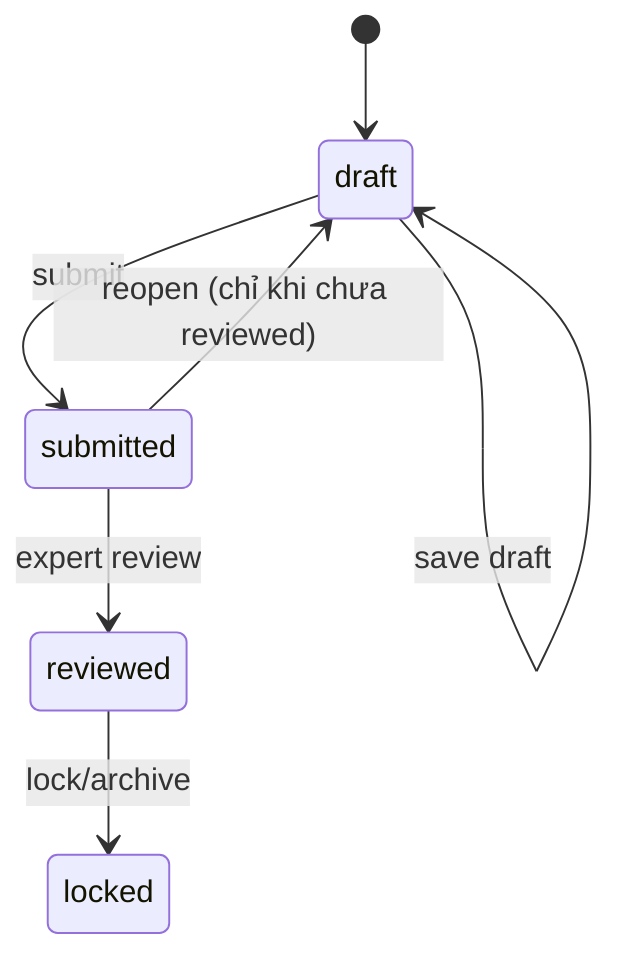
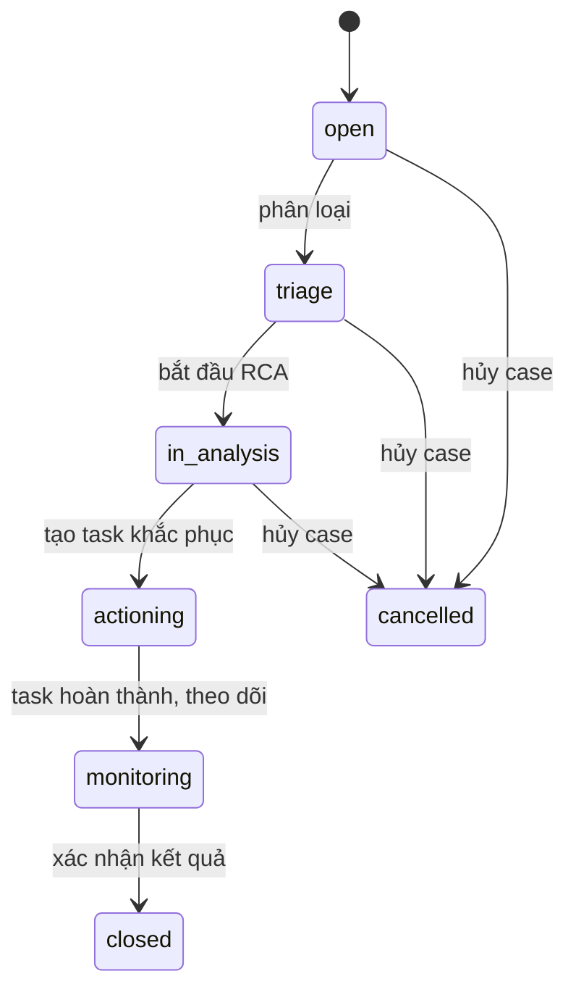
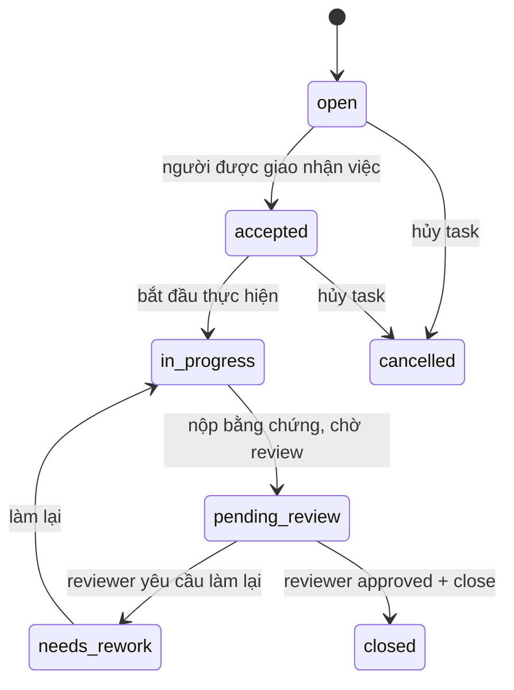
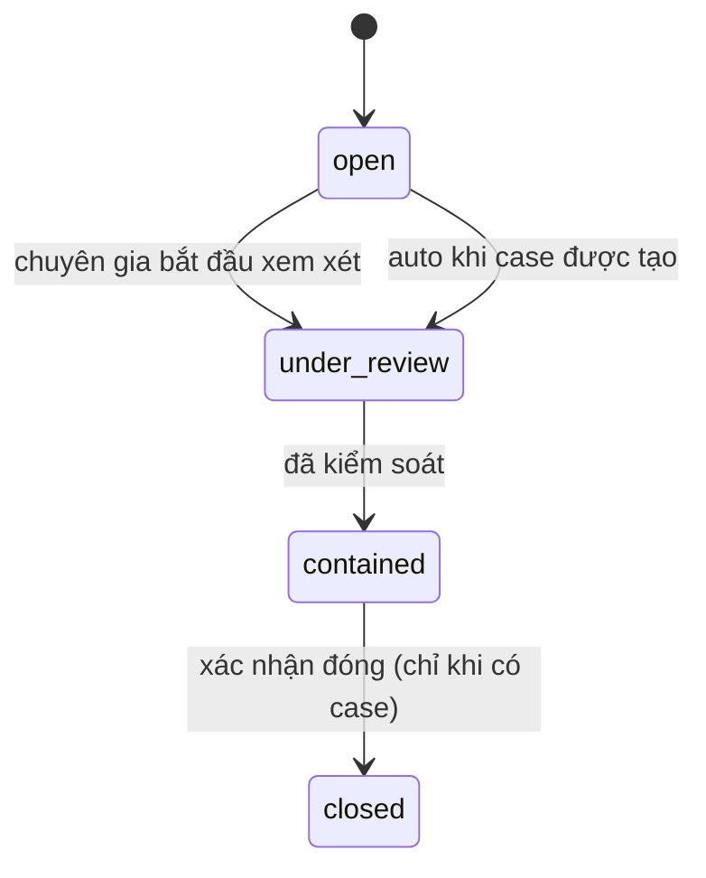

# Yêu cầu hệ thống phần mềm
## BIOSECURITY OS 2026
### Phiên bản yêu cầu hiệu chỉnh theo mô hình **Expert-in-the-Loop**

**Phiên bản tài liệu:** 2.1  
**Ghi chú cập nhật:** Bổ sung quy ước đọc tài liệu bằng tiếng Việt để đồng bộ với ERD/API có chú thích chi tiết.  
**Ngày:** 2026-03-14  
**Trạng thái:** Draft for Review  
**Ngôn ngữ:** Tiếng Việt

---

## 1. Mục đích tài liệu

Tài liệu này mô tả bộ yêu cầu hệ thống phần mềm cho dự án **BIOSECURITY OS 2026** dành cho hệ thống doanh nghiệp chăn nuôi heo gồm khoảng **20 trại tại Việt Nam** (bao gồm trại nái và trại thịt), trong bối cảnh:

- Hạ tầng giữa các trại không đồng nhất.
- Có sự khác biệt lớn giữa **trại công ty** và **trại thuê**.
- Một số trại có lịch sử dịch tễ phức tạp, gần nguồn nguy cơ ô nhiễm, luồng di chuyển chưa tối ưu.
- Doanh nghiệp cần một hệ thống số hóa để **đánh giá - quản trị thực thi - lưu giữ tri thức dịch tễ - duy trì năng lực tổ chức**.

Tài liệu này đã **điều chỉnh định hướng giải pháp** theo quyết định mới:

1. **Không triển khai cơ chế tạo auto-task hoàn toàn tự động** từ Spider Chart trong giai đoạn đầu.
2. **Không triển khai AI learning / AI recommendation** trong giai đoạn đầu.
3. **Không triển khai AI check ảnh** trong giai đoạn đầu.
4. Hệ thống vận hành theo mô hình **expert-in-the-loop**, tức là **chuyên gia dịch tễ / ATSH** là người phân tích nguyên nhân gốc (root cause) và quyết định task khắc phục.
5. Bằng chứng thực địa được xác nhận bằng **ảnh/video có watermark chứa thông tin định vị, thời gian và thông tin người thực hiện**, kết hợp xác minh của chuyên gia.

---


## 1A. Cách đọc tài liệu và quy ước thuật ngữ

- Trong tài liệu này, một số thuật ngữ kỹ thuật được **giữ nguyên tiếng Anh** để đồng bộ với ERD, API và backlog triển khai, ví dụ: `assessment`, `case`, `task`, `review`, `evidence`, `lesson learned`, `scar`.
- Khi một **tên field kỹ thuật** xuất hiện trong bảng hoặc code block, đó là tên dự kiến dùng trong database/API; phần diễn giải nghiệp vụ nên đọc theo tiếng Việt.
- Tài liệu này ưu tiên cách hiểu:
  - **Assessment** = phiếu đánh giá/audit
  - **Case** = hồ sơ rủi ro/sự cố cần chuyên gia xử lý
  - **Task** = công việc khắc phục hoặc phòng ngừa
  - **Evidence** = bằng chứng số như ảnh/video/tài liệu
  - **Scar** = “vết sẹo” lịch sử, điểm tri thức, dấu tích rủi ro gắn với vị trí/bối cảnh
  - **Lesson Learned** = bài học di sản đã được chắt lọc từ case/scar thực tế
- Với các bảng so sánh ở cuối tài liệu, hãy ưu tiên đọc cột **“Bản yêu cầu hiệu chỉnh”** như định hướng chính thức cho giai đoạn đầu.

---

## 2. Tầm nhìn sản phẩm

BIOSECURITY OS 2026 là một nền tảng quản trị An toàn sinh học (ATSH) cho doanh nghiệp chăn nuôi, vận hành như một **hệ điều hành quản trị biosecurity**, thay vì chỉ là phần mềm báo cáo checklist.

Hệ thống hỗ trợ chu trình vận hành sống:

**Scan -> Analyze -> Prescribe -> Execute -> Verify -> Learn**

Trong đó:

- **Scan**: thu thập điểm số, audit, bằng chứng và tín hiệu nguy cơ.
- **Analyze**: chuyên gia dịch tễ/ATSH phân tích nguyên nhân gốc.
- **Prescribe**: chuyên gia đề xuất hành động khắc phục.
- **Execute**: trại thực hiện theo task được giao.
- **Verify**: chuyên gia xác minh kết quả bằng chứng và/hoặc spot check.
- **Learn**: hệ thống lưu lại "vết sẹo", case xử lý, bài học thành công/thất bại để thành tri thức di sản của doanh nghiệp.

---

## 3. Mục tiêu nghiệp vụ

### 3.1 Mục tiêu chính

Hệ thống phải hỗ trợ doanh nghiệp:

- Chuẩn hóa đánh giá ATSH trên toàn bộ hệ thống trại.
- So sánh mức độ an toàn giữa các trại theo cùng một khung quản trị.
- Nhận diện nhanh các lỗ hổng trọng yếu về hạ tầng, quy trình và hành vi.
- Tổ chức việc giao việc, theo dõi khắc phục và xác nhận hoàn thành bằng chứng số.
- Lưu giữ và tái sử dụng tri thức dịch tễ nội bộ, giảm phụ thuộc vào cá nhân.
- Tạo khả năng truy vết lịch sử rủi ro, sự cố, nguồn lây nghi ngờ, biện pháp đã áp dụng và hiệu quả thực tế.

### 3.2 Mục tiêu không nên diễn đạt như cam kết hệ thống

Hệ thống **không được định nghĩa** là công cụ có thể tự bảo đảm tuyệt đối "0% ASF" bằng phần mềm. Thay vào đó, hệ thống phải hỗ trợ:

- giảm xác suất xâm nhập dịch bệnh,
- phát hiện lỗ hổng nhanh hơn,
- rút ngắn thời gian phản ứng,
- chuẩn hóa xử lý,
- tích lũy tri thức để nâng năng lực tổ chức theo thời gian.

---

## 4. Nguyên tắc thiết kế hệ thống

### 4.1 Expert-in-the-loop

Hệ thống phải coi **chuyên gia dịch tễ / ATSH** là chủ thể ra quyết định đối với:

- phân tích nguyên nhân gốc,
- xác định mức độ nghiêm trọng,
- lựa chọn biện pháp khắc phục,
- phê duyệt và đóng case,
- xác nhận lesson learned.

### 4.2 Evidence-first

Không chấp nhận hoàn thành công việc chỉ bằng khai báo. Việc đóng task/case phải dựa trên bằng chứng số có thể kiểm tra.

### 4.3 Memory-first

Mọi sự cố, near-miss, lỗ hổng lặp lại, vị trí lịch sử nguy cơ, nguồn lây nghi ngờ, hành động xử lý và kết quả phải được lưu trữ có cấu trúc.

### 4.4 Không phụ thuộc AI ở giai đoạn 1

Giai đoạn đầu, hệ thống không sử dụng AI để:

- tự sinh task,
- tự suy luận root cause,
- tự đánh giá hình ảnh,
- tự học khuyến nghị.

Mọi khuyến nghị ban đầu là do chuyên gia hoặc bộ playbook chuẩn hóa của doanh nghiệp cấu hình.

### 4.5 Phân biệt rõ 3 lớp thông tin

Hệ thống phải tách bạch:

1. **Điểm tuân thủ** (compliance score)  
2. **Rủi ro cấu trúc nền** (structural risk)  
3. **Tín hiệu dịch tễ / sự kiện thực địa** (live epidemiological signal)

Không được gộp ba lớp này thành một điểm tổng duy nhất gây mất khả năng chẩn đoán.

---

## 5. Phạm vi hệ thống

### 5.1 Trong phạm vi

- Quản lý danh mục trại, khu, chuồng, luồng di chuyển, điểm nguy cơ.
- Quản lý scorecard ATSH theo từng loại trại.
- Ghi nhận tự đánh giá, đánh giá nội bộ, spot audit, blind audit.
- Hiển thị Spider Chart, dashboard xu hướng và benchmark giữa các trại.
- Quản lý các chỉ số killer metrics.
- Tính Trust Score dựa trên độ lệch giữa tự đánh giá và audit độc lập.
- Tạo case rủi ro / case điều tra.
- Cho phép chuyên gia phân tích nguyên nhân gốc và tạo task khắc phục thủ công.
- Quản lý task, SLA, bằng chứng và quy trình xác minh.
- Xây dựng bản đồ vết sẹo (scar map) và kho lesson learned.
- Lưu nhật ký kiểm toán (audit trail).
- Báo cáo điều hành và báo cáo theo trại / theo vùng / theo thời gian.

### 5.2 Ngoài phạm vi giai đoạn 1

- Tự động tạo task chỉ dựa trên Spider Chart.
- AI learning / recommendation engine tự học.
- AI kiểm tra ảnh/video.
- Tự động kết luận nguồn lây.
- Tích hợp trực tiếp thiết bị IoT phức tạp, nếu chưa có chuẩn dữ liệu sẵn.
- Tự động ra quyết định đóng/mở site, dừng nhập đàn, tiêu hủy, hoặc hành động quản trị cấp khẩn cấp mà không có phê duyệt của con người.

---

## 6. Đối tượng sử dụng và phân quyền

### 6.1 Nhóm người dùng

1. **Ban điều hành / lãnh đạo**
   - Xem dashboard tổng thể.
   - Theo dõi risk heatmap, benchmark, KPI, backlog task và trạng thái trọng yếu.

2. **Chuyên gia dịch tễ / ATSH trung tâm**
   - Thiết kế scorecard.
   - Xem dữ liệu toàn hệ thống.
   - Phân tích root cause.
   - Tạo, phê duyệt, ưu tiên và đóng task/case.
   - Xác nhận lesson learned.

3. **Quản lý vùng / quản lý cụm trại**
   - Theo dõi các trại trong phạm vi phụ trách.
   - Điều phối thực hiện và escalation.

4. **Quản lý trại**
   - Gửi tự đánh giá.
   - Tiếp nhận task.
   - Phân công nhân sự nội bộ.
   - Upload bằng chứng.
   - Theo dõi tiến độ.

5. **Thanh tra / kiểm tra mù / QA**
   - Thực hiện audit độc lập.
   - Ghi nhận bằng chứng và kết quả chấm điểm.

6. **Kỹ thuật viên / nhân viên thực địa**
   - Nhận việc.
   - Chụp ảnh/video theo mẫu quy định.
   - Cập nhật tiến độ.

7. **Quản trị hệ thống**
   - Quản lý người dùng, phân quyền, tham số hệ thống, sao lưu, nhật ký hệ thống.

### 6.2 Nguyên tắc phân quyền

- Dữ liệu phải được quản lý theo **RBAC** (Role-Based Access Control).
- Người dùng chỉ được truy cập dữ liệu trong phạm vi trách nhiệm, trừ cấp trung tâm hoặc admin.
- Mọi hành động tạo/sửa/xóa/phê duyệt phải có audit log.

---

## 7. Mô hình nghiệp vụ chính

### 7.1 Chu trình đánh giá và xử lý

1. Trại thực hiện tự đánh giá định kỳ.
2. Thanh tra hoặc chuyên gia thực hiện spot audit/blind audit.
3. Hệ thống cập nhật score, Spider Chart, Trust Score và trạng thái cảnh báo.
4. Nếu có bất thường, hệ thống tạo **Risk Case** hoặc **Case Review Queue**.
5. Chuyên gia dịch tễ/ATSH xem case, phân tích nguyên nhân gốc.
6. Chuyên gia tạo task khắc phục phù hợp.
7. Trại thực hiện task, upload bằng chứng.
8. Chuyên gia xác minh, đóng task hoặc yêu cầu làm lại.
9. Kết quả cuối cùng được liên kết với scar map và lesson learned nếu là case có giá trị tri thức.

### 7.2 Chu trình ghi nhớ vết sẹo

1. Hệ thống ghi nhận một sự kiện hoặc một điểm bất thường quan trọng.
2. Chuyên gia gắn sự kiện đó vào **vị trí cụ thể trên digital twin / sơ đồ trại**.
3. Mỗi “vết sẹo” lưu đầy đủ mô tả, giả thuyết nguồn lây, bằng chứng, hành động khắc phục, kết quả và mức độ tin cậy.
4. Khi có case mới, chuyên gia có thể tra cứu các vết sẹo và bài học tương tự đã xảy ra trước đó.

---

## 8. Yêu cầu chức năng

## 8.1 Quản lý dữ liệu nền (Master Data)

### FR-01. Quản lý danh mục trại
Hệ thống phải cho phép khai báo:

- mã trại,
- tên trại,
- loại trại (nái, thịt, hỗn hợp),
- hình thức sở hữu (công ty, thuê),
- địa chỉ,
- tọa độ,
- vùng phụ trách,
- quy mô,
- trạng thái hoạt động,
- mức độ nhạy cảm/rủi ro nền.

### FR-02. Quản lý cấu trúc nội bộ trại
Hệ thống phải cho phép khai báo cấu trúc logic và/hoặc sơ đồ của trại gồm:

- cổng vào,
- khu sát trùng,
- văn phòng,
- khu thay đồ,
- khu nuôi,
- khu cách ly,
- nơi lưu xác,
- điểm xử lý chất thải,
- kho cám,
- đường nội bộ,
- luồng sạch/bẩn,
- các điểm nguy cơ ngoại sinh.

### FR-03. Quản lý phiên bản sơ đồ trại
Hệ thống phải hỗ trợ lưu **nhiều phiên bản mặt bằng / digital twin** theo thời gian, để các “vết sẹo” được gắn đúng vào bối cảnh lịch sử tại thời điểm xảy ra sự kiện.

---

## 8.2 Scorecard và đánh giá ATSH

### FR-04. Cấu hình bộ scorecard
Hệ thống phải cho phép chuyên gia cấu hình scorecard theo:

- nhóm tiêu chí phần cứng,
- nhóm tiêu chí phần mềm,
- nhóm tiêu chí hành vi,
- nhóm tiêu chí giám sát,
- killer metrics,
- trọng số,
- ngưỡng đạt/chưa đạt,
- mẫu áp dụng cho từng loại trại.

### FR-05. Nhiều mẫu scorecard
Hệ thống phải hỗ trợ nhiều mẫu scorecard khác nhau, ví dụ:

- trại nái,
- trại thịt,
- trại công ty,
- trại thuê,
- site có nguy cơ nền cao.

### FR-06. Tự đánh giá và audit
Hệ thống phải hỗ trợ ghi nhận:

- tự đánh giá của trại,
- audit định kỳ,
- spot audit,
- blind audit,
- re-audit sau khắc phục.

Mỗi lần đánh giá phải lưu:

- người thực hiện,
- thời gian,
- loại đánh giá,
- từng câu hỏi/tiêu chí,
- ảnh/video minh chứng nếu có,
- nhận xét,
- điểm chi tiết,
- điểm tổng,
- trạng thái.

### FR-07. Spider Chart và dashboard điểm số
Hệ thống phải hiển thị:

- Spider Chart theo từng trại,
- so sánh giữa các trại,
- xu hướng theo thời gian,
- so sánh self-report và audit,
- heatmap theo vùng,
- top trại rủi ro cao,
- top trại cải thiện tốt.

### FR-08. Killer Metrics
Hệ thống phải cho phép định nghĩa các killer metrics như:

- vạch đỏ bị phá vỡ,
- đưa thực phẩm lạ vào trại,
- xử lý heo chết sai quy trình,
- vi phạm luồng di chuyển bắt buộc,
- các vi phạm đặc biệt khác do doanh nghiệp quy định.

Khi xảy ra killer metric, hệ thống phải:

- gắn cờ mức độ nghiêm trọng cao,
- chuyển site hoặc case sang trạng thái cảnh báo đặc biệt,
- bắt buộc mở case review,
- yêu cầu phê duyệt của chuyên gia trước khi đóng.

### FR-09. Trust Score
Hệ thống phải tính và hiển thị Trust Score dựa trên độ lệch giữa:

- điểm tự đánh giá,
- điểm audit độc lập,
- tần suất chênh lệch,
- mức độ nghiêm trọng của chênh lệch.

Trust Score phải được thể hiện trên dashboard và là tín hiệu ưu tiên cho hoạt động kiểm tra tiếp theo.

#### FR-09a. Thuật toán Trust Score

**Nguyên lý:** Trust Score đo mức độ trung thực giữa điểm trại tự khai và điểm audit độc lập. Trại khai khống (Self > Audit) bị phạt nặng hơn trại khai thấp hơn thực tế.

**Công thức MVP (Phase 1):**

```
gap        = self_overall_score - audit_overall_score
abs_gap    = |gap|
penalty    = 1.5 nếu gap > 0 (khai khống), 1.0 nếu gap ≤ 0 (khai thấp hơn)

Trust Score = max(0, 100 - abs_gap × penalty × severity_factor)
```

Trong đó:
- `severity_factor` mặc định = 1.0 ở Phase 1.
- Phase 2 có thể bật severity_factor động theo:
  - +0.5 nếu có item killer-related có gap > 2,
  - +0.3 nếu overall gap > 30,
  - +0.2 nếu cùng section bị chênh lệch lặp lại ≥ 2 kỳ liên tiếp.

**Ví dụ minh họa:**

| Self | Audit | Gap | Hướng | Penalty | Severity | Trust Score |
|------|-------|-----|-------|---------|----------|-------------|
| 92   | 90    | +2  | khai khống | 1.5 | 1.0 | 97.0 |
| 60   | 95    | -35 | khai thấp | 1.0 | 1.0 | 65.0 |
| 95   | 60    | +35 | khai khống | 1.5 | 1.0 | 47.5 |
| 80   | 80    | 0   | chính xác | 1.0 | 1.0 | 100.0 |

**Mở rộng Phase 2 — Weighted Section Gap:**

```
section_gaps = {
    hardware:   |self.hw - audit.hw|   × 0.15,
    process:    |self.pr - audit.pr|   × 0.25,
    behavior:   |self.bh - audit.bh|   × 0.35,   ← trọng số cao nhất
    monitoring: |self.mn - audit.mn|   × 0.25,
}
weighted_gap = sum(section_gaps)
Trust Score  = max(0, 100 - weighted_gap × penalty × severity_factor)
```

Schema lưu kết quả tại bảng `trust_score_snapshot` với các cột `trust_score`, `absolute_gap_score` và `severity_factor`.

---

## 8.3 Quản lý case và phân tích nguyên nhân gốc

### FR-10. Tạo Risk Case / Incident Case
Hệ thống phải cho phép tạo case từ các nguồn sau:

- đánh giá có điểm thấp,
- vi phạm killer metric,
- phát hiện lỗ hổng lặp lại,
- phát hiện sự kiện bất thường ngoài checklist,
- yêu cầu điều tra từ chuyên gia,
- sự kiện thực địa / near-miss / nghi ngờ nguồn lây.

### FR-11. Hàng đợi xử lý chuyên gia
Hệ thống phải có màn hình **case review queue** cho chuyên gia ATSH/dịch tễ để:

- xem danh sách case chờ phân tích,
- lọc theo mức độ ưu tiên,
- lọc theo vùng, trại, loại case,
- xem nhanh bằng chứng và lịch sử liên quan,
- gán người xử lý,
- theo dõi SLA xử lý case.

### FR-12. Root Cause Analysis (RCA)
Hệ thống phải cho phép chuyên gia ghi nhận phân tích nguyên nhân gốc theo cấu trúc, bao gồm tối thiểu:

- mô tả sự cố/vấn đề,
- phạm vi ảnh hưởng,
- nguyên nhân trực tiếp,
- nguyên nhân hệ thống,
- nguyên nhân hạ tầng,
- nguyên nhân quy trình,
- nguyên nhân hành vi,
- nguyên nhân giám sát,
- yếu tố ngoại sinh,
- mức độ tin cậy của kết luận,
- người phân tích,
- ngày phân tích.

### FR-13. Mẫu RCA chuẩn hóa
Hệ thống nên hỗ trợ mẫu RCA theo các framework như:

- 5 Why,
- Fishbone/Ishikawa,
- checklist nguyên nhân theo nhóm,
- CAPA (Corrective and Preventive Action).

---

## 8.4 Quản lý task khắc phục

### FR-14. Tạo task thủ công bởi chuyên gia
Hệ thống phải cho phép chuyên gia hoặc người được ủy quyền tạo task khắc phục từ case, với các thuộc tính:

- tiêu đề task,
- mô tả chi tiết,
- loại task,
- liên kết tới case,
- nguyên nhân gốc liên quan,
- site/khu vực áp dụng,
- mức độ ưu tiên,
- hạn hoàn thành,
- người chịu trách nhiệm,
- người phối hợp,
- tài liệu hướng dẫn đính kèm,
- tiêu chí hoàn thành,
- yêu cầu bằng chứng.

### FR-15. Không auto-generate task trong giai đoạn 1
Hệ thống **không bắt buộc** phải tự tạo task chỉ dựa trên điểm Spider Chart. Thay vào đó, hệ thống chỉ cần:

- tạo cảnh báo,
- đưa case vào hàng chờ phân tích,
- hỗ trợ chuyên gia tạo task thủ công nhanh,
- có thể cung cấp mẫu task tham khảo nếu doanh nghiệp cấu hình sẵn.

### FR-16. Priority và SLA
Hệ thống phải hỗ trợ các mức ưu tiên, ví dụ:

- P0: rất khẩn cấp,
- P1: khẩn cấp,
- P2: quan trọng,
- P3: cải tiến dài hạn.

Mỗi mức phải có SLA xử lý và SLA hoàn thành được cấu hình.

### FR-17. Workflow trạng thái task
Task phải có workflow trạng thái tối thiểu:

- New,
- Assigned,
- In Progress,
- Pending Evidence,
- Pending Review,
- Rejected,
- Completed,
- Closed.

### FR-18. Escalation
Hệ thống phải hỗ trợ escalation khi:

- quá hạn,
- thiếu bằng chứng,
- bị từ chối nhiều lần,
- liên quan killer metric,
- lặp lại quá số lần cho phép.

---

## 8.5 Bằng chứng số và xác minh

### FR-19. Upload bằng chứng
Hệ thống phải cho phép upload:

- ảnh,
- video,
- tài liệu,
- biểu mẫu xác nhận,
- biên bản kiểm tra.

### FR-20. Watermark và metadata
Hệ thống phải hỗ trợ hoặc tích hợp quy trình thu thập bằng chứng từ ứng dụng/chức năng có thể hiển thị watermark tối thiểu gồm:

- thời gian chụp,
- tọa độ hoặc thông tin vị trí,
- tên/mã trại,
- tên khu vực,
- người chụp hoặc mã người dùng,
- mã task hoặc mã case nếu có.

Metadata gốc (nếu thiết bị cung cấp) phải được lưu kèm tệp.

### FR-21. Xác minh bằng chứng bởi chuyên gia
Task chỉ được đóng khi có:

- đủ bằng chứng theo yêu cầu,
- xác nhận của chuyên gia ATSH hoặc người được ủy quyền,
- lịch sử review rõ ràng,
- kết luận đạt/chưa đạt.

### FR-22. Rework
Nếu bằng chứng không đạt, hệ thống phải cho phép:

- từ chối bằng chứng,
- ghi rõ lý do,
- yêu cầu làm lại,
- thiết lập hạn nộp lại.

### FR-23. Tính toàn vẹn dữ liệu
Hệ thống phải lưu:

- file gốc,
- người upload,
- thời gian upload,
- lịch sử xác minh,
- hash/tính dấu vết số nếu doanh nghiệp yêu cầu,
- audit trail của mọi hành động liên quan đến bằng chứng.

---

## 8.6 Scar Memory / Digital Twin / Lesson Learned

### FR-24. Digital Twin Mapping
Hệ thống phải có khả năng hiển thị sơ đồ trại hoặc mặt bằng logic để gắn:

- điểm nổ dịch lịch sử,
- vị trí nguồn lây nghi ngờ,
- điểm vi phạm lặp lại,
- vị trí phát hiện heo chết/bất thường,
- điểm tắc nghẽn luồng sạch bẩn,
- điểm rủi ro ngoại sinh.

### FR-25. Quản lý “vết sẹo”
Mỗi scar record phải lưu tối thiểu:

- mã scar,
- trại,
- khu vực/vị trí,
- tọa độ hoặc điểm trên sơ đồ,
- thời gian xảy ra,
- loại sự kiện,
- mô tả,
- nguồn lây nghi ngờ,
- mức độ tin cậy của kết luận,
- bằng chứng liên quan,
- case liên quan,
- task liên quan,
- trạng thái đã xử lý/chưa xử lý,
- đánh giá hiệu quả sau xử lý,
- ghi chú bài học.

### FR-26. Lesson Learned Engine
Hệ thống phải hỗ trợ lưu bài học kinh nghiệm theo cấu trúc:

- vấn đề ban đầu,
- bối cảnh site,
- nguyên nhân gốc,
- biện pháp đã áp dụng,
- kết quả sau thực hiện,
- có tái phát hay không,
- bài học khuyến nghị,
- người xác nhận,
- ngày xác nhận,
- khả năng áp dụng cho site tương tự.

### FR-27. Tra cứu case tương tự
Hệ thống phải cho phép người dùng tra cứu các scar/case/lession tương tự theo:

- loại trại,
- loại vấn đề,
- khu vực nguy cơ,
- loại nguyên nhân,
- loại task đã áp dụng,
- hiệu quả trong quá khứ.

Lưu ý: đây là **tra cứu có cấu trúc**, không phải AI recommendation bắt buộc.

### FR-28. Phân loại mức độ tin cậy tri thức
Hệ thống phải cho phép gán mức độ tin cậy cho từng case/scar/lesson, ví dụ:

- suspected,
- probable,
- confirmed,
- archived,
- obsolete.

Điều này nhằm tránh biến “tri thức di sản” thành kho tin đồn không kiểm soát.

---

## 8.7 Cảnh báo, thông báo và điều hành

### FR-29. Cảnh báo hệ thống
Hệ thống phải phát sinh cảnh báo khi:

- điểm một trục xuống dưới ngưỡng,
- Trust Score xuống thấp,
- xuất hiện killer metric,
- task quá hạn,
- case chưa được chuyên gia xử lý trong SLA,
- có lặp lại cùng loại vi phạm trong khoảng thời gian xác định.

### FR-30. Thông báo đa kênh
Hệ thống nên hỗ trợ gửi thông báo qua:

- email,
- ứng dụng nội bộ,
- web notification,
- các kênh nhắn tin doanh nghiệp nếu được tích hợp sau.

### FR-31. Dashboard điều hành
Dashboard phải hỗ trợ:

- tổng quan điểm ATSH toàn hệ thống,
- phân nhóm theo vùng / loại trại / hình thức sở hữu,
- danh sách site cần attention,
- top killer metrics,
- backlog task,
- tỷ lệ hoàn thành đúng hạn,
- top scar lặp lại,
- site có Trust Score thấp,
- xu hướng cải thiện hoặc suy giảm theo thời gian.

---

## 8.8 Báo cáo

### FR-32. Báo cáo vận hành
Hệ thống phải xuất được báo cáo như:

- báo cáo điểm ATSH theo tháng,
- báo cáo theo vùng,
- báo cáo so sánh trại công ty và trại thuê,
- báo cáo case phát sinh,
- báo cáo task quá hạn,
- báo cáo killer metrics,
- báo cáo lesson learned,
- báo cáo trust gap.

### FR-33. Xuất dữ liệu
Hệ thống phải cho phép xuất báo cáo/dữ liệu tối thiểu sang:

- PDF,
- Excel/CSV,
- hình ảnh dashboard nếu cần.

---

## 8.9 Nhật ký kiểm toán và truy vết

### FR-34. Audit trail nghiệp vụ
Hệ thống phải ghi nhận đầy đủ ai đã:

- tạo/sửa/xóa scorecard,
- nhập/sửa kết quả audit,
- tạo/sửa case,
- tạo/sửa task,
- upload/xóa bằng chứng,
- xác minh hoặc từ chối bằng chứng,
- tạo/sửa scar,
- xác nhận lesson learned,
- thay đổi phân quyền.

### FR-35. Khả năng truy vết
Hệ thống phải cho phép truy vết từ một điểm bất thường tới:

- lần đánh giá liên quan,
- case liên quan,
- task liên quan,
- bằng chứng liên quan,
- scar liên quan,
- lesson learned liên quan,
- người tham gia xử lý.

---

## 9. Quy tắc nghiệp vụ quan trọng

### BR-01. Spider Chart là công cụ cảnh báo, không phải công cụ ra đơn tự động
Hệ thống không được mặc định coi việc điểm thấp đồng nghĩa với một biện pháp khắc phục cố định.

### BR-02. Task khắc phục phải gắn với phân tích nguyên nhân gốc hoặc quyết định của chuyên gia
Trong giai đoạn 1, task chỉ được tạo bởi người có quyền hoặc từ template được họ chủ động chọn.

### BR-03. Killer metric phải kích hoạt case review bắt buộc
Vi phạm killer metric không được tự động coi là "đã xử lý" nếu chưa có review của chuyên gia.

### BR-04. Không đóng task nếu thiếu bằng chứng hoặc thiếu review
Bằng chứng là điều kiện cần; xác minh của chuyên gia là điều kiện đủ.

### BR-05. Scar chỉ được xác nhận là bài học di sản khi có người chịu trách nhiệm xác nhận
Không phải mọi ghi chú hiện trường đều trở thành tri thức chuẩn của doanh nghiệp.

### BR-06. Trust Score thấp làm tăng mức ưu tiên kiểm tra độc lập
Site có độ lệch khai báo cao phải được đưa vào kế hoạch giám sát chặt hơn.

### BR-07. Assessment luôn snapshot phiên bản scorecard template tại thời điểm tạo
Khi tạo assessment, hệ thống phải ghi nhận `template_id` trỏ tới phiên bản cụ thể của scorecard đang active tại thời điểm đó. Khi scorecard template được cập nhật hoặc tạo version mới, các assessment cũ không bị ảnh hưởng vì chúng đã gắn với version cũ. Điều này đảm bảo tính toàn vẹn khi so sánh điểm lịch sử.

### BR-08. Liên kết polymorphic phải được kiểm tra tính toàn vẹn ở tầng ứng dụng
Các bảng `scar_link` và `lesson_reference` sử dụng cơ chế polymorphic FK (`linked_object_type` + `linked_object_id`). Do database không thể enforce FK cho dạng này, **application layer bắt buộc phải validate** rằng `linked_object_id` tồn tại trong bảng tương ứng với `linked_object_type` trước khi insert. Backend service phải có unit test bao phủ trường hợp này.

### BR-09. Các thực thể có state machine phải hỗ trợ optimistic locking
Các bảng `risk_case`, `corrective_task`, `assessment` và `killer_metric_event` phải có cột `version` (integer, tăng mỗi lần update). API phải hỗ trợ `If-Match` / ETag header để tránh race condition khi nhiều người cùng thao tác trên một bản ghi.

---

## 9A. Quy tắc chuyển trạng thái (State Machine)

### 9A.1 Assessment Status



### 9A.2 Risk Case Status



### 9A.3 Corrective Task Status



### 9A.4 Killer Metric Event Status



---

## 10. Yêu cầu phi chức năng

## 10.1 Hiệu năng và quy mô

### NFR-01. Quy mô
Hệ thống phải đáp ứng quy mô ban đầu tối thiểu:

- 20 trại, có thể mở rộng tới 50 trại mà không cần thay đổi kiến trúc,
- 100 người dùng đồng thời (concurrent users),
- 5.000 bản ghi đánh giá/tháng,
- 50.000 file ảnh/video/bằng chứng tích lũy trong năm đầu tiên.

### NFR-02. Hiệu năng
- Thời gian tải dashboard: ≤ 3 giây (P95) trong điều kiện vận hành bình thường.
- API response cho thao tác CRUD đơn: ≤ 500ms (P95).
- API response cho báo cáo tổng hợp/analytics: ≤ 5 giây (P95).

### NFR-03. Phản hồi giao diện
- Các thao tác nghiệp vụ phổ biến (tạo task, cập nhật trạng thái, mở case, xem ảnh) phải có phản hồi ≤ 1 giây trên web và ≤ 2 giây trên thiết bị di động 4G.

## 10.2 Khả dụng và an toàn dữ liệu

### NFR-04. Sao lưu
Hệ thống phải có cơ chế sao lưu định kỳ cho:

- cơ sở dữ liệu: sao lưu tự động hàng ngày, giữ ít nhất 30 bản,
- object storage: replication hoặc sao lưu hàng ngày,
- cấu hình hệ thống: version control.

### NFR-05. Phục hồi
- **RPO (Recovery Point Objective):** ≤ 1 giờ — mất tối đa 1 giờ dữ liệu khi xảy ra sự cố.
- **RTO (Recovery Time Objective):** ≤ 4 giờ — hệ thống phải hoạt động trở lại trong 4 giờ.

### NFR-06. Kiểm soát truy cập dữ liệu
Dữ liệu bằng chứng và dữ liệu điều tra phải được kiểm soát truy cập chặt chẽ. File evidence đã qua review không được phép xóa vật lý.

### NFR-06a. Lưu trữ dữ liệu
- Dữ liệu evidence, case, scar và lesson learned phải được lưu trữ tối thiểu **5 năm**.
- Audit log phải được lưu trữ tối thiểu **3 năm**.
- Dữ liệu assessment phải được lưu trữ tối thiểu **5 năm** để phục vụ phân tích xu hướng dài hạn.

### NFR-06b. Khả dụng
- Uptime mục tiêu: **99.5%** (không tính thời gian bảo trì đã thông báo trước).

## 10.3 Bảo mật

### NFR-07. Xác thực và phân quyền
Hệ thống phải hỗ trợ:

- xác thực người dùng bằng JWT (access token + refresh token),
- phân quyền theo vai trò (RBAC),
- mã hóa truyền tải (TLS 1.2+),
- audit log cho mọi thao tác tạo/sửa/xóa/phê duyệt,
- kiểm soát phiên đăng nhập (session timeout, revoke token),
- lưu trữ mật khẩu bằng hash an toàn (bcrypt/argon2), không lưu plaintext.

### NFR-08. Soft delete và toàn vẹn dữ liệu
- Các bảng chứa dữ liệu điều tra (`risk_case`, `corrective_task`, `scar_record`, `lesson_learned`, `attachment`) phải hỗ trợ soft delete bằng cột `archived_at`.
- Dữ liệu đã soft delete không hiển thị trên UI mặc định nhưng vẫn truy vấn được cho mục đích kiểm toán.

### NFR-08a. Upload Policy
- Loại file cho phép: `image/jpeg`, `image/png`, `image/webp`, `video/mp4`, `video/quicktime`, `application/pdf`.
- Kích thước tối đa: 50 MB cho ảnh, 500 MB cho video, 20 MB cho PDF.
- Hệ thống nên tích hợp quét virus bất đồng bộ cho file mới upload.
- Rate limit upload: tối đa 30 file/phút/user.

## 10.4 Tính sử dụng

### NFR-09
Giao diện phải phù hợp cho người dùng hiện trường, thao tác ngắn gọn, dễ dùng trên điện thoại.

### NFR-10
Hệ thống nên hỗ trợ thao tác ngoài hiện trường với điều kiện mạng yếu; nếu chưa có offline-first, phải có cơ chế retry upload và lưu tạm.

## 10.5 Mở rộng

### NFR-11
Kiến trúc phải cho phép mở rộng thêm sau này cho:

- IoT,
- tích hợp ERP/nội bộ,
- rule-based recommendation,
- AI recommendation,
- computer vision,
- phân tích dịch tễ nâng cao.

---

## 11. Yêu cầu dữ liệu

## 11.1 Các thực thể dữ liệu chính

Hệ thống tối thiểu phải có các nhóm dữ liệu sau:

- Farm
- Farm Zone / Area
- Floorplan / Digital Twin Version
- Scorecard Template
- Assessment / Audit
- Assessment Item Result
- Killer Metric Event
- Trust Score Snapshot
- Risk Case / Incident Case
- RCA Record
- Corrective Task
- Task Evidence
- Review / Verification
- Scar Record
- Lesson Learned
- User / Role / Permission
- Notification
- Audit Log

## 11.2 Quan hệ dữ liệu cốt lõi

- Một **Farm** có nhiều **Assessment**.
- Một **Assessment** có nhiều **Assessment Item Result**.
- Một **Assessment** có thể phát sinh nhiều **Risk Case**.
- Một **Risk Case** có thể có một hoặc nhiều **RCA Record**.
- Một **Risk Case** có thể sinh nhiều **Corrective Task**.
- Một **Corrective Task** có nhiều **Task Evidence** và **Review**.
- Một **Scar Record** có thể liên kết với **Risk Case**, **Task**, **Evidence** và **Lesson Learned**.
- Một **Lesson Learned** có thể tham chiếu nhiều case/scar liên quan.

---

## 12. Kiến trúc kỹ thuật định hướng

Đây là phần định hướng, không bắt buộc khóa cứng, nhưng phù hợp với mục tiêu giai đoạn 1.

### 12.1 Backend
- FastAPI (Python)

### 12.2 Frontend
- Vue.js 3
- PrimeVue
- Apache ECharts

### 12.3 Database
- PostgreSQL
- Khuyến nghị bổ sung **PostGIS** nếu cần xử lý bản đồ/vị trí/digital twin nâng cao
- Có thể dùng TimescaleDB cho dữ liệu chuỗi thời gian

### 12.4 Cache / Queue
- Redis

### 12.5 Storage
- MinIO để lưu trữ ảnh/video/tài liệu bằng chứng

### 12.6 Workflow / Automation
- n8n chỉ nên dùng cho:
  - thông báo,
  - nhắc hạn,
  - đồng bộ tác vụ đơn giản,
  - tích hợp ngoài.

Không nên đặt **business logic cốt lõi** như RCA, quyết định task hay xác minh vào n8n.

### 12.7 Mobile/Web capture
- Web responsive hoặc mobile app/hybrid app để chụp ảnh bằng chứng có watermark và upload nhanh.

---

## 13. Phạm vi MVP đề xuất

MVP nên tập trung vào các năng lực cốt lõi sau:

1. Quản lý danh mục trại và mặt bằng logic.
2. Cấu hình scorecard.
3. Tự đánh giá và audit.
4. Spider Chart và dashboard cơ bản.
5. Killer metrics.
6. Trust Score.
7. Case queue cho chuyên gia.
8. RCA cơ bản.
9. Tạo task thủ công.
10. Upload bằng chứng có watermark.
11. Review / xác minh task.
12. Scar map cơ bản.
13. Lesson learned cơ bản.
14. Audit trail.
15. Thông báo và báo cáo cơ bản.

### Không nên đưa vào MVP

- AI recommendation,
- AI image validation,
- auto-task engine phức tạp,
- suy luận dịch tễ tự động,
- mô hình predictive analytics phức tạp.

---

## 14. Kế hoạch triển khai đề xuất

### Giai đoạn 1 - Foundation
- Master data
- Scorecard
- Assessment/Audit
- Spider Chart
- Case + RCA cơ bản
- Task + Evidence + Verification

### Giai đoạn 2 - Memory Layer
- Digital Twin / Scar Map
- Lesson Learned
- Tra cứu case tương tự
- Báo cáo nâng cao

### Giai đoạn 3 - Optimization
- Templated prescriptions
- Rule-based suggestions do chuyên gia cấu hình
- Tối ưu hóa workflow và tích hợp hệ thống liên quan

---

## 15. Tiêu chí nghiệm thu mức cao

Hệ thống được coi là đạt yêu cầu giai đoạn 1 khi tối thiểu:

1. Người dùng có thể tạo và quản lý đầy đủ danh mục 20 trại.
2. Có thể cấu hình scorecard khác nhau cho trại công ty và trại thuê.
3. Có thể ghi nhận self-audit và blind audit.
4. Dashboard hiển thị Spider Chart, xu hướng và Trust Score.
5. Chuyên gia có thể mở case, ghi RCA và tạo task.
6. Trại có thể upload bằng chứng ảnh/video có watermark.
7. Chuyên gia có thể xác minh, từ chối hoặc đóng task.
8. Có thể ghi nhận ít nhất một scar trên sơ đồ trại và liên kết với case thực tế.
9. Có thể tra cứu lịch sử xử lý và xuất báo cáo cơ bản.
10. Mọi hành động quan trọng đều có audit trail.

---

## 16. Rủi ro triển khai và yêu cầu kiểm soát

### R-01. Rủi ro “đẹp dashboard nhưng yếu thực địa”
**Kiểm soát yêu cầu:** bắt buộc evidence + review + spot audit ngẫu nhiên.

### R-02. Rủi ro tri thức bị ghi nhận thiếu chuẩn
**Kiểm soát yêu cầu:** cấu trúc hóa RCA, scar và lesson learned; có người xác nhận.

### R-03. Rủi ro hệ thống quá phức tạp ở giai đoạn đầu
**Kiểm soát yêu cầu:** ưu tiên MVP, bỏ AI và auto-task engine phức tạp.

### R-04. Rủi ro phụ thuộc cá nhân chuyên gia
**Kiểm soát yêu cầu:** chuẩn hóa template RCA, task, lesson learned và dashboard review.

### R-05. Rủi ro dữ liệu ảnh/video bị tranh cãi
**Kiểm soát yêu cầu:** watermark, metadata, lưu file gốc, lịch sử xác minh, audit trail.

---

## 17. Kết luận yêu cầu định hướng

Phiên bản yêu cầu này định vị BIOSECURITY OS 2026 là một hệ thống:

- **không tự động hóa quá mức**,
- **không phụ thuộc AI ở giai đoạn đầu**,
- **lấy chuyên gia làm trung tâm ra quyết định**,
- **lấy bằng chứng số làm nền xác minh**,
- **lấy scar memory / tri thức di sản làm lợi thế cạnh tranh lâu dài**.

Đây là định hướng phù hợp hơn với bối cảnh thực tế của doanh nghiệp chăn nuôi trong giai đoạn đầu triển khai, vì giảm rủi ro kỹ thuật, tăng khả năng chấp nhận của tổ chức, đồng thời vẫn bảo vệ được giá trị cốt lõi của dự án.

---

## 18. Phụ lục: Tóm tắt thay đổi so với bản định hướng ban đầu

| Nội dung | Bản ban đầu | Bản yêu cầu hiệu chỉnh |
|---|---|---|
| Auto-task từ Spider Chart | Có | Bỏ trong giai đoạn 1 |
| AI learning / best practice tự học | Có định hướng | Bỏ trong giai đoạn 1 |
| AI check ảnh | Có định hướng | Bỏ trong giai đoạn 1 |
| Cơ chế ra quyết định vá lỗi | Hệ thống tự sinh task | Chuyên gia phân tích RCA rồi tạo task |
| Cơ chế đóng task | Ảnh/video + xác nhận | Giữ nguyên, nhấn mạnh evidence + review |
| Scar Memory | Có | Giữ và nâng thành lõi tri thức doanh nghiệp |
| Vai trò chuyên gia | Quan trọng | Trở thành trung tâm của workflow |

