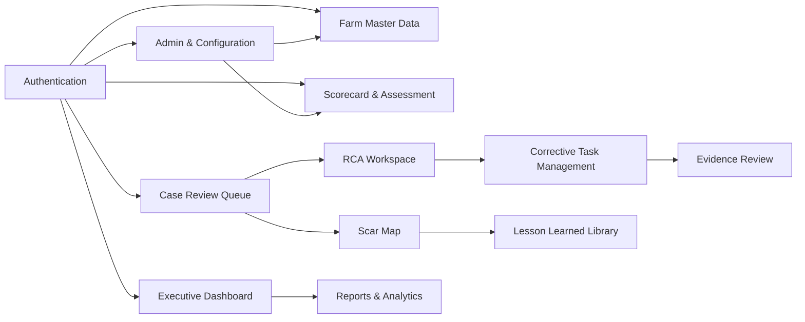

# Module map và wireframe định hướng
## BIOSECURITY OS 2026

**Phiên bản:** 1.1  
**Ghi chú cập nhật:** Bổ sung chú giải tiếng Việt cho nhãn giao diện và tên cột thường gặp.  
**Ngày:** 2026-03-14  
**Mục tiêu:** Thống nhất information architecture, module boundaries và bố cục màn hình chính cho web/mobile MVP.

---

## 1. Nguyên tắc UI/UX

1. **Ngắn gọn cho hiện trường**: người dùng trại phải thao tác nhanh, ít chữ, ít bước.
2. **Sâu cho chuyên gia**: chuyên gia ATSH cần timeline, evidence, RCA và scar map trên cùng một luồng.
3. **Quan sát trước, hành động sau**: dashboard và queue phải giúp nhìn thấy vấn đề trước khi vào phân tích.
4. **Evidence-first**: task detail phải luôn hiển thị rõ tiêu chí hoàn thành, evidence bắt buộc, review history.
5. **Memory-first**: scar và lesson không được bị giấu như tab phụ; phải là module trung tâm.

---


## 1A. Chú giải nhãn UI và cách đọc wireframe

- Các nhãn trong wireframe hiện đang dùng **kết hợp Anh - Việt** để giữ tính đồng bộ với tài liệu API/backlog. Khi vào Figma hoặc triển khai thật, có thể Việt hóa 100%.
- Một số cụm từ cần hiểu như sau:
  - **Open Case** = mở hồ sơ rủi ro/sự cố để chuyên gia xử lý
  - **Pending Review** = đang chờ chuyên gia/QA xem xét
  - **Overdue** = quá hạn theo SLA hoặc hạn hoàn thành
  - **Timeline** = dòng thời gian lịch sử hành động
  - **Evidence** = bằng chứng số
  - **Scar Map** = bản đồ “vết sẹo”/điểm tri thức trên sơ đồ trại
  - **Lesson Library** = thư viện bài học di sản
- Các bảng trong màn hình list view nên hiển thị **tên cột bằng tiếng Việt rõ nghĩa** ở UI cuối cùng; phần tiếng Anh trong tài liệu chỉ là placeholder cho đội thiết kế/kỹ thuật.

### 1.1 Gợi ý Việt hóa tên cột ngoài giao diện

| Nhãn kỹ thuật trong wireframe | Gợi ý hiển thị ngoài giao diện |
|---|---|
| Farm Code | Mã trại |
| Ownership | Hình thức sở hữu |
| Baseline Risk | Rủi ro nền |
| Last Score | Điểm gần nhất |
| Priority | Mức ưu tiên |
| Severity | Mức độ nghiêm trọng |
| Assigned Expert | Chuyên gia phụ trách |
| Due | Hạn xử lý |
| Confidence | Độ tin cậy |
| Recurrence count | Số lần tái diễn |


## 2. Bản đồ module tổng thể



### Module cấp 1
- Dashboard điều hành
- Trại & Digital Twin
- Scorecard & Assessment
- Killer Metrics & Trust Score
- Risk Case & RCA
- Corrective Task & Evidence Review
- Scar Map & Lesson Learned
- Reports
- Admin cấu hình

---

## 3. Information architecture

```text
BIOSECURITY OS
├── Dashboard
│   ├── Tổng quan hệ thống
│   ├── Theo vùng
│   ├── Theo trại
│   ├── Trust gaps
│   ├── Killer metrics
│   └── Scar hotspots
├── Trại
│   ├── Danh sách trại
│   ├── Hồ sơ trại
│   ├── Khu vực / luồng
│   ├── Floorplan / Digital Twin
│   └── Điểm rủi ro ngoại sinh
├── Assessment
│   ├── Scorecard templates
│   ├── Tự đánh giá
│   ├── Audit / Blind audit
│   ├── Spider Chart
│   └── Lịch sử đánh giá
├── Cases
│   ├── Queue chờ xử lý
│   ├── Chi tiết case
│   ├── RCA
│   ├── Timeline
│   └── Case attachments
├── Tasks
│   ├── Danh sách task
│   ├── Task detail
│   ├── Evidence upload
│   ├── Review history
│   └── Escalations
├── Memory
│   ├── Scar map
│   ├── Scar detail
│   ├── Lessons library
│   └── Similar cases search
├── Reports
│   ├── Báo cáo tháng
│   ├── Báo cáo backlog
│   ├── Báo cáo trust gap
│   └── Export center
└── Admin
    ├── Users / Roles
    ├── Lookup / SLA
    ├── Killer metrics definitions
    ├── Notification rules
    └── Audit logs
```

---

## 4. Wireframe màn hình web chính

## 4.1 Dashboard điều hành

### Mục tiêu
Phục vụ ban điều hành, chuyên gia trung tâm, quản lý vùng.

### Bố cục
```text
+----------------------------------------------------------------------------------+
| Top Nav: Logo | Search | Notifications | User Menu                               |
+----------------------------------------------------------------------------------+
| Sidebar                                                                       |
| Dashboard                                                                      |
| Farms                                                                          |
| Assessments                                                                    |
| Cases                                                                          |
| Tasks                                                                          |
| Memory                                                                         |
| Reports                                                                        |
| Admin                                                                          |
+----------------------+-----------------------------------------------------------+
| Filter Bar           | [Vùng] [Loại trại] [Sở hữu] [Thời gian] [Apply]          |
+----------------------+-----------------------------------------------------------+
| KPI 1 Avg Score      | KPI 2 High Risk Farms | KPI 3 Open Cases | KPI 4 Overdue |
+----------------------+-----------------------------------------------------------+
| Left: Spider/Trend per region        | Right: Trust gap ranking                  |
|                                      |                                           |
+--------------------------------------+-------------------------------------------+
| Left: Killer metrics trend           | Right: Scar hotspot heatmap               |
+--------------------------------------+-------------------------------------------+
| Backlog task by priority / SLA breach / sites needing attention                |
+----------------------------------------------------------------------------------+
```

### Widget bắt buộc
- KPI cards
- Xu hướng điểm ATSH theo tháng
- Top site risk
- Top site trust gap
- Killer metric trend
- Scar hotspot ranking
- Backlog task theo priority

---

## 4.2 Danh sách trại

```text
+----------------------------------------------------------------------------------+
| Page title: Farms                                                                |
| Search [___________] [Filter: region] [Filter: farm type] [Filter: ownership]  |
+----------------------------------------------------------------------------------+
| Table/List                                                                       |
| Farm Code | Farm Name | Type | Ownership | Region | Baseline Risk | Last Score   |
|-----------|-----------|------|-----------|--------|---------------|--------------|
| FARM-001  | Trại A    | Sow  | Company   | South  | Medium        | 82           |
| FARM-002  | Trại B    | Meat | Leased    | West   | High          | 64           |
+----------------------------------------------------------------------------------+
| Actions: View | Edit | Open Dashboard | Open Scar Map                            |
+----------------------------------------------------------------------------------+
```

### Hồ sơ trại
```text
+----------------------------------------------------------------------------------+
| Farm Header: FARM-001 | Trại A | Sow | Company | Risk: Medium                     |
| Tabs: Overview | Areas & Routes | Floorplans | Assessments | Cases | Tasks | Memory |
+----------------------------------------------------------------------------------+
| Overview Cards: Capacity | Last Audit | Last Trust Score | Open Cases | Overdue Tasks|
+----------------------------------------------------------------------------------+
| Structural Risk Note                                                             |
| External Risk Points                                                             |
| Recent events timeline                                                           |
+----------------------------------------------------------------------------------+
```

---

## 4.3 Scorecard template builder

### Người dùng chính
Chuyên gia ATSH / admin cấu hình.

```text
+----------------------------------------------------------------------------------+
| Template Header: Scorecard - Sow Leased High Risk                                |
| Version 3 | Status: Draft | [Activate] [Archive] [Clone]                        |
+----------------------------------------------------------------------------------+
| Left panel: Sections                                                             |
| - Hạ tầng                                                                        |
| - Quy trình                                                                      |
| - Hành vi                                                                        |
| - Giám sát                                                                       |
+---------------------------+------------------------------------------------------+
| Section detail            | Item list                                             |
| Name                      | Code | Question | Weight | Type | Killer | Order     |
| Weight                    |------------------------------------------------------|
| Display order             | + Add item                                            |
+---------------------------+------------------------------------------------------+
```

### Lưu ý UX
- Có nút clone template để tạo mẫu cho trại nái / trại thịt / trại thuê.
- Có badge cho `killer-related`.

---

## 4.4 Màn hình nhập assessment

### Mục tiêu
Cho quản lý trại, auditor hoặc QA nhập đánh giá nhanh trên web/mobile.

```text
+----------------------------------------------------------------------------------+
| Assessment Header: FARM-001 | Self Assessment | 14/03/2026                      |
| Progress: 24/60 items completed                                                  |
+----------------------------------------------------------------------------------+
| Left: Section navigator                                                           |
| 1. Hạ tầng                                                                       |
| 2. Quy trình                                                                     |
| 3. Hành vi                                                                       |
| 4. Giám sát                                                                      |
+-------------------------------+--------------------------------------------------+
| Question card                 | Evidence panel                                   |
| [Item code]                   | [Upload photo] [Attach existing]                |
| Câu hỏi / tiêu chí            | Thumbnail list                                  |
| Response type                 |                                                  |
| Score                         |                                                  |
| Note                          |                                                  |
| Area                          |                                                  |
| [Save draft] [Next]          |                                                  |
+-------------------------------+--------------------------------------------------+
| Bottom summary: score preview | flagged items | killer flags                     |
+----------------------------------------------------------------------------------+
```

### Hành vi cần hỗ trợ
- Save draft liên tục
- Highlight item không đạt
- Nếu item là killer-related thì bật panel xác nhận sự kiện

---

## 4.5 Màn hình Spider Chart và benchmark

```text
+----------------------------------------------------------------------------------+
| FARM-001 - Assessment Summary                                                    |
| Filters: [Assessment version] [Compare with last audit] [Compare with peers]     |
+----------------------------------------------------------------------------------+
| Left: Spider Chart                   | Right: Score summary                       |
|                                      | - Overall                                  |
|                                      | - Hardware                                 |
|                                      | - Process                                  |
|                                      | - Behavior                                 |
|                                      | - Monitoring                               |
+--------------------------------------+-------------------------------------------+
| Trust gap chart                      | Low-scoring items list                      |
+--------------------------------------+-------------------------------------------+
| Actions: [Create case] [Export] [Open farm profile]                              |
+----------------------------------------------------------------------------------+
```

### Lưu ý
- Không có nút “Auto-create tasks”.
- Chỉ có `Create case` hoặc `Open review queue`.

---

## 4.6 Case review queue

### Mục tiêu
Đây là màn hình trung tâm cho chuyên gia ATSH.

```text
+----------------------------------------------------------------------------------+
| Case Review Queue                                                                 |
| Filters: [Priority] [Status] [Region] [Farm] [Case type] [Trust gap] [SLA]      |
+----------------------------------------------------------------------------------+
| Queue table                                                                       |
| Case No | Farm | Type | Priority | Severity | Assigned Expert | SLA | Status     |
|---------|------|------|----------|----------|-----------------|-----|-----------|
| C-001   | A    | low  | P1       | High     | Expert 1        | 2h  | new       |
| C-002   | B    | KM   | P0       | Critical | Expert 2        | 1h  | in_review |
+----------------------------------------------------------------------------------+
| Right side quick preview                                                         |
| - Summary                                                                        |
| - Source assessment/killer metric                                                |
| - Last score                                                                     |
| - Trust score                                                                    |
| - Recent scars                                                                   |
| [Open case detail]                                                               |
+----------------------------------------------------------------------------------+
```

### Sort gợi ý mặc định
1. P0 / killer metric
2. SLA sắp breach
3. site trust score thấp
4. case lặp lại nhiều lần

---

## 4.7 Case detail + RCA workspace

```text
+----------------------------------------------------------------------------------+
| Case Header: C-001 | FARM-001 | P1 | High | Status: In Review                    |
| Actions: [Assign expert] [Change status] [Create task] [Create scar]             |
+----------------------------------------------------------------------------------+
| Tabs: Overview | RCA | Tasks | Evidence | Timeline | Similar Cases                |
+----------------------------------------------------------------------------------+
| LEFT COLUMN                                | RIGHT COLUMN                         |
| Summary                                    | Farm context                         |
| - Title                                    | - Farm type                          |
| - Source event                             | - Ownership                          |
| - Priority / Severity                      | - Baseline structural risk           |
| - Area                                     | - Last trust score                   |
| - Description                              | - Related scars                      |
+--------------------------------------------+--------------------------------------+
| RCA Workspace                                                                    |
| Method: [5 Why / Fishbone / CAPA]                                                |
| Problem statement                                                                 |
| Direct cause | System cause | Structural cause | Behavior cause | External factor |
| Confidence level                                                                  |
| Factors list                                                                      |
| [Save RCA] [Approve RCA]                                                         |
+----------------------------------------------------------------------------------+
```

### Bắt buộc
- Trong tab `Similar Cases`, hiển thị scar và lesson gần giống theo filter có cấu trúc.
- Có timeline đầy đủ assessment -> event -> RCA -> task -> review.

---

## 4.8 Task detail + evidence review

```text
+----------------------------------------------------------------------------------+
| Task Header: T-001 | Checklist tồn kho hóa chất khu cổng | P1 | Pending Review   |
| Linked case: C-001 | Owner: Farm Manager A | Due: 16/03/2026                     |
+----------------------------------------------------------------------------------+
| LEFT: Task details                          | RIGHT: Evidence & Review             |
| - Description                               | Required evidence                    |
| - Completion criteria                       | [Thumbnail 1] [Thumbnail 2]         |
| - Assignees                                 | [Upload more]                        |
| - Status history                            | Review history                       |
| - Comments                                  | - Reviewer                           |
|                                             | - Result                             |
|                                             | - Note                               |
+---------------------------------------------+--------------------------------------+
| Bottom actions                                                                    |
| [Submit for review] [Approve] [Reject] [Request rework] [Close task]             |
+----------------------------------------------------------------------------------+
```

### Luật giao diện
- `Close task` chỉ hiện active khi đã có review approved.
- Nếu reviewer reject, phải mở form nhập lý do.

---

## 4.9 Scar map

### Mục tiêu
Biến tri thức hiện trường thành trí nhớ có thể tra cứu.

```text
+----------------------------------------------------------------------------------+
| Scar Map - FARM-001                                                               |
| Filters: [Scar type] [Confidence] [Status] [Date range] [Floorplan version]      |
+----------------------------------------------------------------------------------+
| LEFT: Floorplan / Map Canvas                  | RIGHT: Selected scar detail         |
| [marker] [marker] [marker]                    | Title                               |
|                                               | Type                                |
|                                               | Confidence                          |
|                                               | Event date                          |
|                                               | Source of risk                      |
|                                               | Linked cases/tasks/evidence         |
|                                               | Recurrence count                    |
|                                               | [Open case] [Open lesson]           |
+-----------------------------------------------+-------------------------------------+
| Bottom strip: Scar timeline / quick list                                            |
+----------------------------------------------------------------------------------+
```

### Tối thiểu cho MVP
- Marker dạng điểm
- Popup scar detail
- Filter theo loại và độ tin cậy
- Link sang case/task/lesson

---

## 4.10 Lesson learned library

```text
+----------------------------------------------------------------------------------+
| Lesson Learned Library                                                            |
| Search [_______________________]                                                  |
| Filters: [Farm type] [Ownership] [Issue type] [Confidence] [Status] [Tag]       |
+----------------------------------------------------------------------------------+
| Left: Result list                             | Right: Lesson detail                |
| Lesson No | Title | Confidence | Last update | Title                              |
|-----------|-------|------------|-------------| Problem context                     |
| L-001     | ...   | confirmed  | 14/03/2026  | Root cause summary                  |
| L-002     | ...   | probable   | 10/03/2026  | Action summary                      |
|                                           | Outcome summary                        |
|                                           | Applicability scope                    |
|                                           | References: cases/scars/tasks          |
|                                           | Similarity tags                        |
+----------------------------------------------------------------------------------+
```

### UX note
- Cần badge rõ `suspected / probable / confirmed / obsolete`.
- Không nên trình bày như chatbot recommendation; đây là thư viện tri thức có kiểm duyệt.

---

## 4.11 Audit log / admin review

```text
+----------------------------------------------------------------------------------+
| Audit Logs                                                                        |
| Filters: [Actor] [Action] [Entity type] [Date range] [Farm]                      |
+----------------------------------------------------------------------------------+
| Time | Actor | Action | Entity | Entity ID | Summary                             |
|------|-------|--------|--------|-----------|-------------------------------------|
| ...  | ...   | ...    | task   | T-001     | review changed from rejected->approved |
+----------------------------------------------------------------------------------+
| Drawer detail: before_json / after_json / IP / user agent                         |
+----------------------------------------------------------------------------------+
```

---

## 5. Wireframe mobile / hiện trường

## 5.1 Mobile home

```text
+------------------------------+
| BIOSECURITY OS               |
| Xin chào, Quản lý trại A     |
+------------------------------+
| [Tasks của tôi]              |
| [Assessment hôm nay]         |
| [Upload evidence nhanh]      |
| [Thông báo]                  |
+------------------------------+
| Open tasks: 5                |
| Pending review: 2            |
| Overdue: 1                   |
+------------------------------+
```

## 5.2 Evidence capture screen

```text
+------------------------------+
| Task T-001                   |
| Chụp bằng chứng              |
+------------------------------+
| Camera preview               |
|                              |
|   Watermark overlay          |
|   14/03/2026 15:10           |
|   FARM-001 | Gate            |
|   user_12 | task T-001       |
|                              |
+------------------------------+
| [Take photo] [Record video]  |
| [Retake] [Use this]          |
+------------------------------+
```

## 5.3 Mobile task detail

```text
+------------------------------+
| T-001 | Pending Review       |
+------------------------------+
| Mô tả task                   |
| Tiêu chí hoàn thành          |
| Hạn                          |
| Người phụ trách              |
+------------------------------+
| Bằng chứng đã upload         |
| [thumb] [thumb] [thumb]      |
+------------------------------+
| [Upload thêm]                |
| [Submit for review]          |
+------------------------------+
```

## 5.4 Mobile assessment quick entry

```text
+------------------------------+
| Assessment: FARM-001         |
| Item 12/60                   |
+------------------------------+
| Câu hỏi                      |
| "Bồn sát trùng có đủ hóa chất?" |
+------------------------------+
| ( ) Đạt                      |
| ( ) Không đạt                |
| Score [0-5]                  |
| Note                         |
+------------------------------+
| [Save] [Next]                |
+------------------------------+
```

---

## 6. Điều hướng theo vai trò

### Ban điều hành
- Vào dashboard tổng thể
- Drill-down tới vùng hoặc trại cần attention
- Xem backlog, trust gap, killer metrics, scars trọng điểm

### Chuyên gia ATSH
- Vào queue case
- Mở case detail + RCA
- Tạo task
- Review evidence
- Tạo scar / lesson

### Quản lý trại
- Vào tasks của site mình
- Cập nhật assessment
- Upload evidence
- Xem lịch sử case và scar liên quan site

### QA / blind auditor
- Tạo assessment / audit
- Upload evidence
- Mở case khi phát hiện bất thường

---

## 7. Component library nên có

- KPI card
- Status badge
- Priority badge
- Confidence badge
- Timeline component
- Attachment gallery
- Side drawer detail
- Review panel
- Spider chart component
- Floorplan marker layer
- Structured filter bar

PrimeVue + ECharts đủ để làm MVP nếu thống nhất component sớm.

---

## 8. Trạng thái màu sắc gợi ý

Không khóa cứng màu brand, nhưng nên thống nhất logic:
- `critical / P0 / killer metric`: đỏ
- `high / P1`: cam
- `monitoring / pending review`: vàng
- `completed / validated`: xanh
- `archived / obsolete`: xám

---

## 9. Danh sách màn hình ưu tiên cho MVP

1. Login
2. Dashboard tổng quan
3. Danh sách trại + farm profile
4. Scorecard template builder
5. Assessment entry
6. Spider chart summary
7. Case review queue
8. Case detail + RCA
9. Task detail + evidence review
10. Scar map
11. Lesson library
12. Notifications
13. Audit logs cơ bản
14. User/role admin

---

## 10. Kết luận

Wireframe và module map ở trên đủ để đội BA/UI/PM bắt đầu:
- tách user flow,
- lập backlog theo màn hình,
- xác định component dùng lại,
- và chia rõ ranh giới giữa dashboard, case management, evidence verification và scar memory.

Đây là bản wireframe ở mức cấu trúc. Bước tiếp theo hợp lý là chuyển từng màn hình trọng điểm thành bản low-fidelity chi tiết hơn trong Figma hoặc slides nội bộ.
